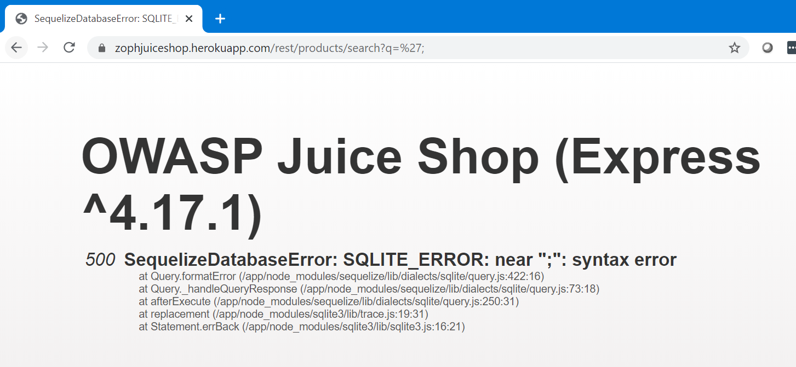

## Retrieve a list of all user credentials via SQL Injection

1. Open the search page and reload the page with F5 while observing the Network tab in your browser's DevTools (F12).

2. Conduct a search and then look at the Network Tab of DevTools, paying specific attention to the search **GET** request.

3. You'll notice that `/rest/products/search?q=` is called. This is probably part of a legacy search that still remains within the code. Let's test this functionality, though, by updating our URL with the following `<yoururl>.herokuapp.com/rest/products/search?q=orange`

4. You should see someting similar, telling us that this database can potentially be leveraged to execute commands that it shouldn't. Let's test this by updating the end of our URL to `search?q=';`

5. We're now dabbling in what is called **blind SQL injection** where we try various commands, and hope for a bit of luck, to get the database to try to dump what we want it. Entire books have been written on this, so we're not going to dive into the details. In the interest of time, let's search for this `'))--`

6. We see now that the entire list of products has been dumped. Now comes the fun part, crafting a **UNION SELECT** statement that will pull data from the user's table in the database. 

7. 