## Setting up Ubuntu

## Instructions

1. Navigate to https://www.osboxes.org/ubuntu/ and scroll down to the Ubuntu 19.04 Disco Dingo link, clicking on the **Download** button for the **VirtualBox** image. 

2. Once the download has finished, feel free to put the file in the location where you'll store your VM's. Perhaps a folder called **VMs** in your Documents location, or another location of your choosing. 

3. Right click on 19.0464.7z, and select **Extract Here**
  * **Note:** If you do not have 7zip installed you can install it from here: https://www.7-zip.org/download.html 

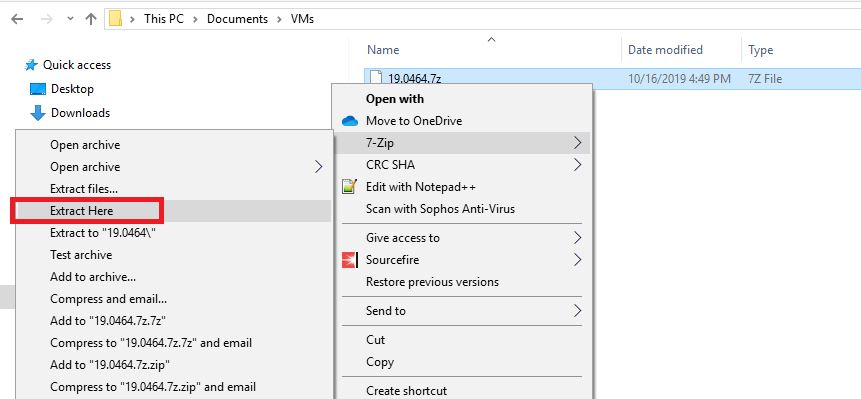

4. Allow the package to extract (this may take a few minutes). Once it is done extracting, you sholud see a file called **Ubuntu 19.04**.

5. Next, open VirtualBox and click on the **New** button. 
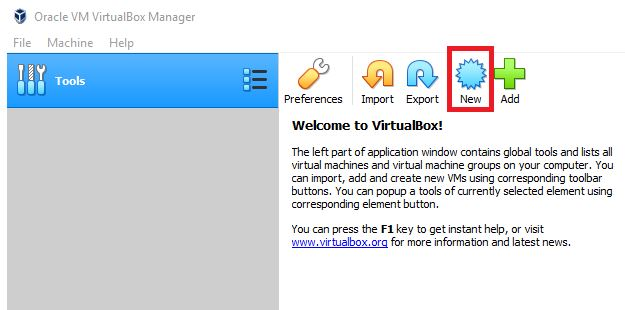

6. Give your VM a name, like **Ubuntu** and specificy the location where you want to store it. I recommend creating another folder called **Ubuntu** that is seperate from the file you just downloaded. Click **Next**. 
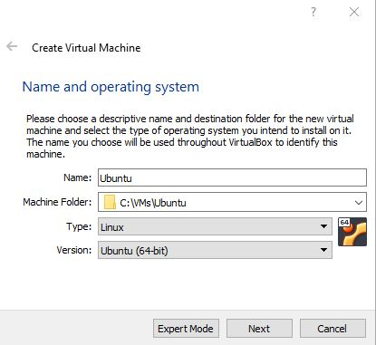

7. Specify how much RAM you want to give your VM. This will vary depending on the specifications of your laptop, but try to get at least **2048** MB of RAM. Click **Next**. 
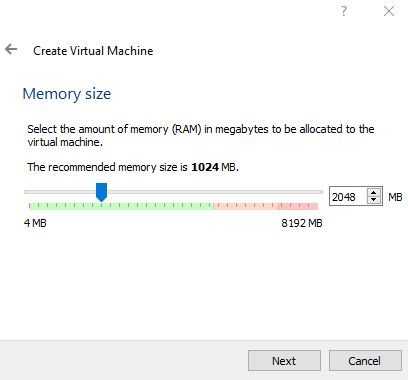

8. Select the **Use an existing virtual hard disk file** option and then click on the folder icon. Select the **Add** button and then navigate to your Ubuntu 19.04 file, then click **Open** and then click **Choose**. 
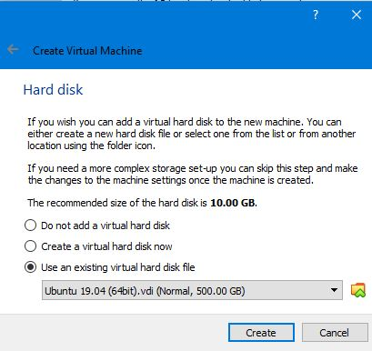

9. Now, click **Create**. You should see a screen like the following: 
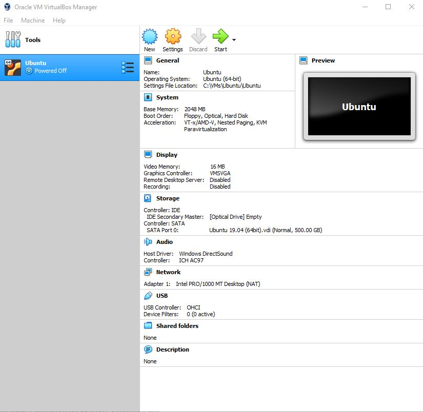

10. Click on the **Start** arrow and allow your virtual machine to power up. 

11. The default username is **osboxes.org** and the default password is **osboxes.org**

# Instructions

1. Navigate to http://releases.ubuntu.com/disco/
  
2. Download the following file
  

3. Once it's down downloading, start up Virtual Box and then click on **New**.
  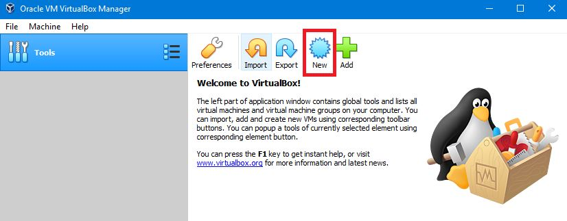

4. Name your virtual machine **Ubuntu** and select a directory to save it (or use the default) and then click **Next**.
  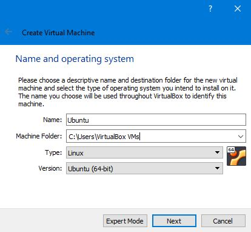

5. For memory size, keep in mind how much memory your laptop has. 2048 mb is recommended, but if your laptop can afford to have it larger, change it (you can always change this later, too). Then click **Next**.
  

6. When asked about the Hard disk, select the **Create a virtual hard disk now** option and click **Create**. 
  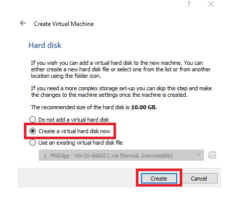

7. On the Hard disk file type screen, leave the default setting and click on **Next**.
  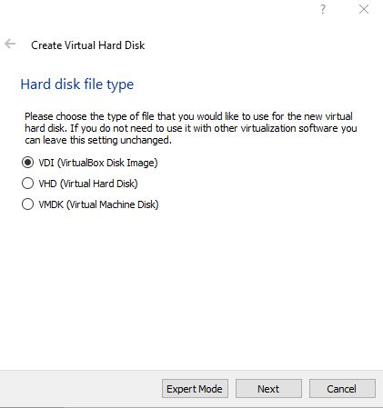

8. Leave the next window default setting checked as well and click **Next**. 
  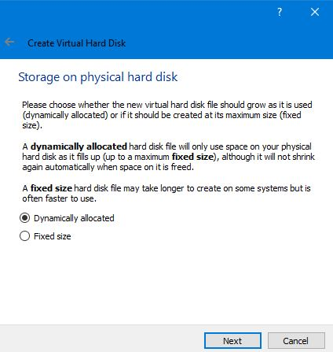

9. For file location and size, if you're unsure if you want to change it leave the default settings and click on **Create**.
  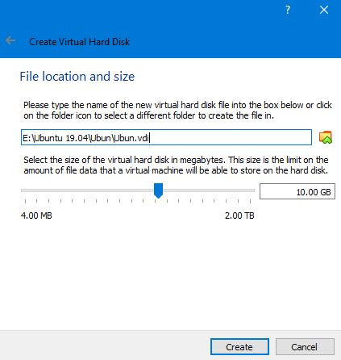

10. One the virtual machine is created, click on the green **Start** arrow.

11. You'll be asked for a start-up disk. Navigate to the .iso file you downloaded earlier and then select **Start**.
  

12. The Ubuntu installation process will now begin. 

13. When prompted, select **Install Ubuntu**.
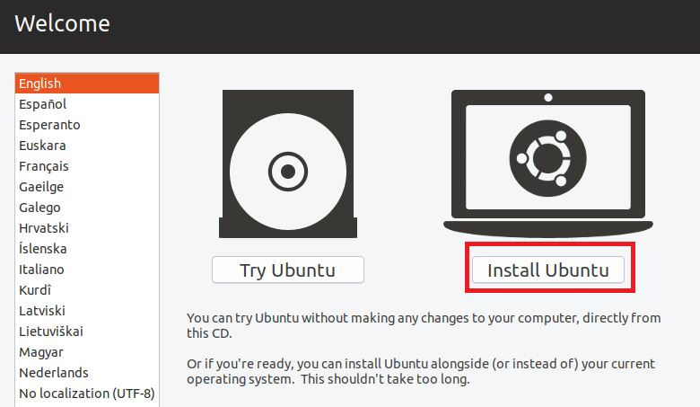

14. Select your language and then click on **Continue**.

15. Leave the **Updates and other software** settings their default and click **Continue**. 
  * NOTE: You can check the **Install third party software for graphics and Wi-Fi hardware and additional media formats** if you want.

16. On the **Installation type** screen leave **Erate disk and install Ubuntu** checked and click on **Install Now**
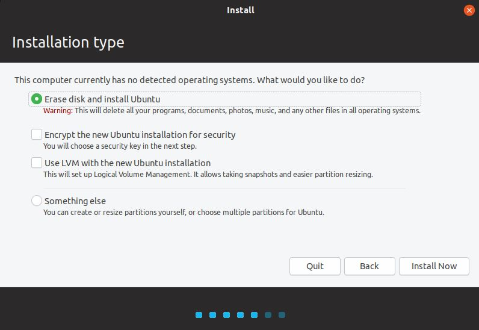

17. Click on **Continue** when prompted to confirm. Note: This will only format the virtual drive you created during step 6. 

18. Fill out the next few screens as they pop up. Restart when prompted. 

