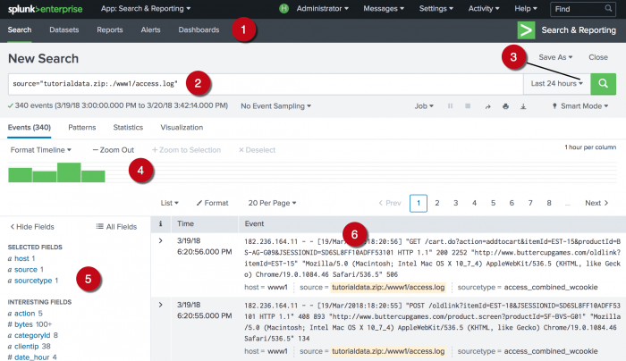

## Review Guide: Uploading a Web Log into Splunk

### Review

In this exercise, students learned how to upload a web log into Splunk and displayed the results in the Search window.

* Please have TAs check that all students successfully uploaded and can see the events in the search window.

* Point out the **elements of the Search Window** using this slide or the Splunk system.

	

1. **Apps bar** contains main functions.

2. **Search bar** specifies your search criteria.

3. **Time range picker** specifies the time period (minutes, days, hours, weeks) for the search.

	* Explain that time is the most important search parameter to specify. For example, for historical searches you can specify a time range such as *15 minutes ago* or *Yesterday*.

	* Time can be used to restrict searches to custom dates and time ranges.

4. Explain that peaks or valleys in the **timeline** can indicate spikes in activity or server downtime.

	* Tell students they can zoom out, zoom in, and also change the scale of the chart.

5. **Selected Fields and Interesting Fields:** This sidebar displays a list of the fields discovered in the events. 

	* Explain that when you first run a search, the **Selected Fields** list contains the **default fields** host, source, and source type. The default fields appear in every event.

	* **Interesting Fields** are fields that appear in at least 20% of the events.

	* Next to the field name is a **count** of the how many events the field name appears. 
	
	* Tell students that we can select any field name to show more information about that field.

6. **Events viewer** displays the events that match your search. 

	* Explain that by default, the most recent event is listed first and the matching search terms are highlighted.

Please address any questions students may have before proceeding to the next section.	
