## SIEMs Day 1: Introduction to Security Information and Event Management using Splunk Student Guide

### Lesson Overview

Today's lesson is the first part of Security Information and Event Management (SIEM) unit and the first class of the next three units that will cover the defensive aspects of cybersecurity. Today, you will be introduced to SIEMs and begin working specifically with the Splunk interface. 

### Learning Objectives

By the end of class, you will be able to:

* Recognize the role that SIEMs play in protecting the security of an organization.

* Explain how logs are filtered, normalized and correlated for events.

* Use basic features of the Splunk User Interface.

* Explain basic database terms and query functions like operators and expressions.

* Use the Splunk Processing Language (SPL) for simple queries.

### Student Notes

* This class contains several demonstrations using the [Splunk Enterprise SIEMS](https://www.splunk.com/en_us/software/splunk-enterprise/features.html). Please familiarize yourself with Splunk and run through all the demonstrations before class in order to ensure a smooth class experience. 

* If at any point throughout the lesson plan, you have an opportunity to relate the topic at hand to your own professional experience, please feel free to share.

### Lesson Content Overview

This lesson will be the first class over the next three units that will cover the defensive aspects of cybersecurity

Today's lectures, demos and student activities are comprised of the following: 

* An introduction to SIEMS (benefits and use cases), followed by a vendor research activity.

* Next, you will learn how a SIEMs collects, normalizes, and correlates events data. The corresponding activity prepares you for working with the Splunk SIEM.

* After the break, we'll dive into the [Splunk SIEMS](https://docs.splunk.com/Documentation/Splunk). You will learn about features and functions of Splunk, and then activate and log into Splunk using a web interface.

* Next, you will be guided through the user interface as they learn how to upload a webserver log into Splunk.

* The lesson concludes with a review of database concepts and an introduction to the Search Processing Language (SPL).  SPL is similar in syntax to SQL. By the end of class you will be executing your own simple searches.

### Lesson Lab Environment

The classroom setup will require the following:

* Ubuntu Virtual Machine 18.04

* Splunk Enterprise 7.2.4.2

* For the walkthroughs, use the following file: `access_30Day.log`, located [here](Resources/tmp/access_30DAY.log).


### Student Lab Requirements

- For the walkthroughs, and labs, you will need to download these files to your VM: https://drive.google.com/open?id=1WZoLMQNmBqXnMLYqt413Dj5m9qL6Gw6M


### Additional Reading


- [Main Documentation Page](https://docs.splunk.com/Documentation/Splunk)
- [About the Search Processing Language](https://docs.splunk.com/Documentation/Splunk/7.2.5/Search/Aboutthesearchlanguage)
- [Understanding SPL Syntax](https://docs.splunk.com/Documentation/Splunk/7.2.5/SearchReference/UnderstandingSPLsyntax)
- [Search Tutorial](https://docs.splunk.com/Documentation/Splunk/7.2.4/SearchTutorial/WelcometotheSearchTutorial)
- [Splunk Search Manual](https://docs.splunk.com/Documentation/Splunk/7.2.4/Search/GetstartedwithSearch)


### Lesson Slideshow

- The slides for today can be viewed on Google Drive here: [SIEMS Day 1 Slides](https://docs.google.com/presentation/d/1iUr4-PBg9k1wElI1sYzPW_foG4Bhc2CNMxdcllyJDL8/edit)

- **Note:** Editing access is not available for this document. If you wish to modify the slides, please create a copy by navigating to File > "Make a copy...". 

---

### 01. Introduction to SIEMs
 
As stated before, by the end of class you will be able to:

* Recognize the role that SIEMs play in protecting the security of an organization.

* Explain how logs are filtered, normalized and correlated for events.

* Use basic features of the Splunk User Interface.

* Explain basic database terms and query functions like operators and expressions.

* Use the Splunk Processing Language (SPL) for simple queries.

#### The Challenge Facing Security Teams

* There are two troubling realities for information security teams: 

    * An organization's IT infrastructure has a variety of systems and applications on their networks, including host systems, product applications, network devices, firewalls and other security devices. 

    * It can be a challenge for organizations to have full visibility into their network with all these devices to keep track of, therefore making suspicious behavior more difficult to detect. 

#### The Solution: SIEMs

* Organizations use SIEMs to monitor odd behavior and irregular traffic on their network, allowing infosec teams to more effectively detect suspicious activity. 

* SIEM is an approach to security management that combines Security Information Management (SIM) and Security Event Management (SEM) functions into one system. 

	* The term **Security Information Event Management** was coined by *Mark Nicolett* and *Amrit Williams* of Gartner in 2005.	
	
* The basic goals and functions of SIEMs are:  
	
	* A SIM provides long-term storage, analysis and reporting of log data. 
		
	* A SIEM's main goal is detecting threats based on known patterns.
		
	* A SIEM connects and unifies the information from various sources thus allowing the data to be analyzed and cross-referenced.
				
		 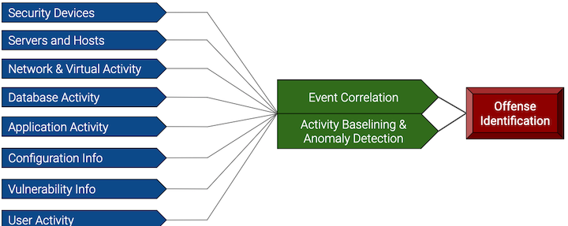 
	
* SIEMs provide **real-time monitoring** of machine data to correlate events, baselines, notifications, alerts, reports and visualizations.
	
* SIEMS do not support **security analytics**, which creates behaviors and profiles using machine learning and applies statistical analysis to detect anomalies that could indicate a potential threat.  However *next-generation SIEMs* are combining machine learning in the form of User Entity Behavior Analysis (UEBA).
	
#### Benefits of using SIEMs
		
Some of the core advantages of using SIEMs are: 

* **Increasing efficiency:** Organizations can use SIEMs to gather and monitor a large amount of logs into one place using a simple interface.

* **Preventing potential security threats:** SIEMs monitor and alert on suspicious activity in the logs. Organizations can get notified early on potential threats by reducing the **mean time to detect** (MTTD) and the **mean time to respond** (MTTR) to cyber threats.

* **Reducing the impact of security breaches:** Review of logs will show certain areas of the network that may need additional security controls which can be put in place to mitigate or even stop a breach.

* **Reducing costs:** One central system is used to view, monitor, and alert. Organizations can reduce costs on hardware and software.

* **Better reporting, log analysis, and retention:** One system collects all of the logs and makes it easier to generate reports and analyze logs.

* **IT compliance:** The depth of visibility into the logs makes its possible for organizations to see if they remain compliant.
	

#### SIEM Use Cases

Here are just a few use cases of how SIEMs help security teams detect and respond to security incidents.

* Security Operations Center (SOC) and Security Analyst (SA) teams use SIEMS to analyze data in order to detect malicious cyber attacks across devices, systems, applications, and network infrastructures.

	

* **Threat Hunting:** Developing and testing a hypothesis by exploring logs; searching data for security patterns similar to a current security incident.

* **Detect Data Exfiltration:** Detecting emails sent to persons other than the intended recipient; identifying and report on excessive print and send alerts to a trouble ticket system.

*  **Internet of Things (IoT) Security:** Identifying unusual traffic that results in Denial of Service (DoS) attacks; identifying suspicious behavior of devices and alert security teams.

* **Privileged Access Abuse:**   Monitoring suspicious access to sensitive data; reporting on users that are accessing data outside of their regular profile; reporting on activity to terminated user accounts.

* If applicable at this point of the lesson, please feel free to share with the of how you have used SIEMs in your career.


### Logs, Events, Analysis and Response

In this section, we'll describe how logs are processed and used by a SIEMS.  We will cover the flow of raw data to event data for purposes of the correlation of events, analysis and action. 

We will also be introducing events, baselines, and thresholds in Splunk. These concepts should provide more context for you once you begin using Splunk.

* Now that we've look at how SIEMS collect logs from different sources and how security teams use log data to detect and respond to security incidents.  

	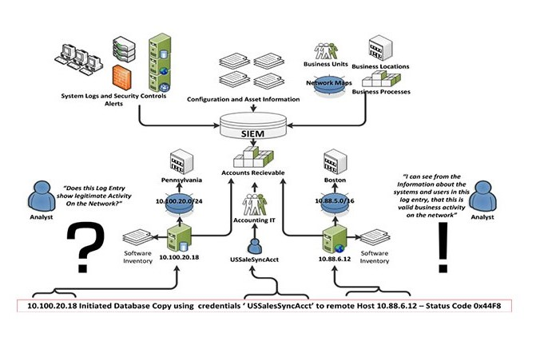 

* In order to work with SIEMs, it is essential to understand how log data is processed into events and how the resulting events are analyzed.

	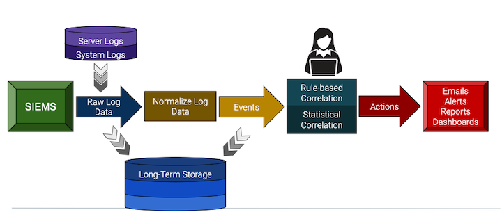 

#### How Do SIEMS Parse, Identify and Assist in Analysis of Events?	
 
* Use the following next sub-sections to provide a high-level overview of how SIEMs identify, categorize, and analyze incidents and events.

	* Notice that parsing, log normalization and categorization occur automatically.

#### Collect Raw Log Data

* The identification process begins with **raw log data** being collected in real-time from various sources.

* Take a look at this example of TCP, SSL and FTP events from a network log.

	

#### Normalize Raw Log Data

* Next, the raw log data is mapped to various elements such as **source and destination IP**, in order to produce a **common format or metadata** for event types. This is an important step before correlating events. 

* Notice that the data is **indexed** and extended term storage is provided for both raw and event data.

* There are different fields that were mapped from the raw data using **Splunk**. (You can refer to the raw data example above.)

	* For example: in this event, the *destination ip* and *destination port* have been parsed, identified and labeled.
	
	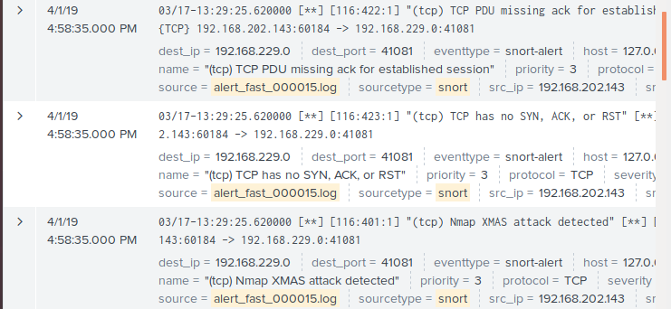		

#### Correlate Events and State Data

* It is important to note that **correlation is the driver for analysis and actions**.

* SIEMS capture *state data*. This differentiates SIEMS from log management systems. 

	* State data is information regarding the *full state* of a system: configurations, current applications, active users, processes, registry settings, and vulnerabilities. 
	
	* Understanding the full state of the system is the foundation for all security-related decisions.

* Event correlation is finding relationships between seemingly unrelated events in data.  We *group together* several similar or dissimilar events to see if something is happening in the network or system.

* Correlation can be done using **rules** or **statistical analysis**. 

#### Rule-based Event Correlation 

*  A SIEM correlation rule indicates which sequences of events could be indicative of anomalies which may suggest weaknesses or the start or remnants of a cyber attack.
	
* Give a rule-based example. This may be demonstrated using a SQL-like pseudo language.

* If the SIEMS detects:

	```bash
		A connection event 
	
		AND 
	
		A failed login event 
	
		AND
	
		An application launched in some place in the system 
	
		Action: Create an Alert
	
		This may be a system compromise or insider abuse of system privileges
	```	
	
Next, we'll cover statistical-based methods. 

#### Statistical Event Analysis	
	
*  **Statistical analysis** can be used to flag more latent issues or events that resembles other events. 

* Statistical methods use things like **frequencies**, **baselines** and **thresholds**. The statistical data can be *visualized* (e.g., charts, dashboards, metrics) in a SIEMS.

* Next, we'll take a look at a few examples of how statistical techniques are used. 

#### Frequencies

* We can *count* the source and destination IP addresses in an incoming log across all log sources.  A spike in the number of occurrences of a destination IP address may be an early warning sign that someone is targeting an attack to this system.

#### Baselines

* Baselines provide a measure of what is normal in a SIEM's data set 
	
* A baseline is calculated over a period of time to get an idea of how something operates normally. Once enough data has been gathered, we can then acknowledge events outside of the baseline that might signal a possible issue.
	
Here are just a few examples of baseline usage: 
	
* User login and logoffs, both successful and failed.

* Network traffic bytes, both inbound and outbound.

* Network traffic to particular ports/services/protocols.

* Administrative account usage/access.

* Processes running on a server.

	
#### Thresholds
 
* Thresholds are used for determining when something exceeds a baseline value. 
	
* Here are a few threshold exapmples using *time* and/or *frequency*:  
	
	* A server that normally receives an average of 20 failed logins *per hour* and is now receiving 50.
		
	* Hits on port 443 over the *last week*.

	* User logins to a server *X times per day*.

	* Use of *su* command *per hour of day*.	


### Working with Logs and Events Activity

In this activity, you will review one log event (that we will continue to use later in Splunk). The goal is to allow you to **see** the data and **understand** the normalization process, that is, how log data maps to the Splunk fields and how to use them.

* The first part of the activity presents interview-based questions on the functions and features of SIEMS.

* Then, there is a hands-on exercise that involves basic normalizing of raw data (parsing, identifying and labeling).  This will introduce you to **event fields** in Splunk.

* Finally, you will correlate events using **pseudo-code**. This will prepare you to understand and formulate **queries** using the **Search Processing Language** (SPL) and how to use the SPL in security investigations. The SPL is similar to SQL.

* There is an EXTRA CHALLENGE section involving the use of stats such as *frequency* and *time*.

### Introduction to Splunk

Now that you have a foundational understanding of SIEMs, we can explore one specific SIEM known as Splunk. 

* **Splunk Enterprise** is an SIEM software platform used to search, analyze and visualize machine-generated data gathered from websites, applications, sensors, and other devices that comprise an IT infrastructure and business.

* Down below are just a few examples of where Splunk is used in security operations:

	* [City of Los Angeles](https://www.splunk.com/en_us/customers/success-stories/city-of-los-angeles.html)

	* [Rackspace]( https://www.splunk.com/en_us/customers/success-stories/rackspace.html) 

	* [Orbis](https://www.splunk.com/en_us/customers/success-stories/orbis.html)
	
	* [Discovery Communications](https://www.splunk.com/en_us/customers/success-stories/discovery-communications.html)


* Splunk provides a web interface to view logs from many different sources in real time. We will use the web interface in the lesson exercises.

	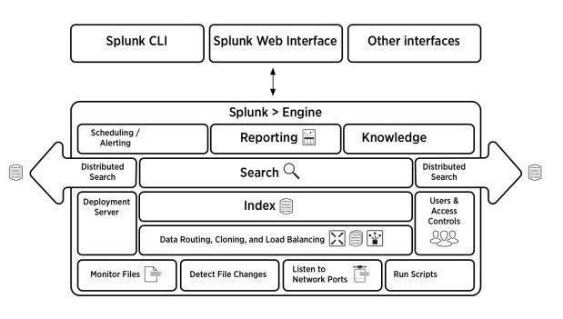	

* Listed below are Splunk's key features and functionalities:

    * Analyze system performance

    * Troubleshoot failures
		
    * Monitor business metrics

    * Search and investigate a particular outcome

    * Create dashboards to visualize & analyze results

    * Store and retrieve data for later use

* Next, here are just a few benefits of implementing Splunk: 

	* Input data can be in any format, like `.csv`, `json`, etc. 

  	* Splunk can be configured to give Alert and Event notifications at the onset of a machine state.

  	* Splunk can accurately predict the resources needed for scaling up the infrastructure.

  	* Create knowledge objects for Operational Intelligence.  

#### Activating and Logging into Splunk	  

* Because you are already using the VM that we have provided you, you will **not** have to go through the Splunk installation. However, we have left the configuration open for you to set the username and password to what ever you'd like. Listed down below are the commands you would use to log into Splunk for the first time.

	- Open a terminal window.
	
	- Type: `start_splunk`
	
	- Type: `Y` (to accept the terms of service)
	
	- Type: `<username>` for the username
	
	- Type: `<password>` for the password

* Next, open a web browser.	
	
	- Navigate to:`http://127.0.0.1:8000` once Splunk has finished setting up.

		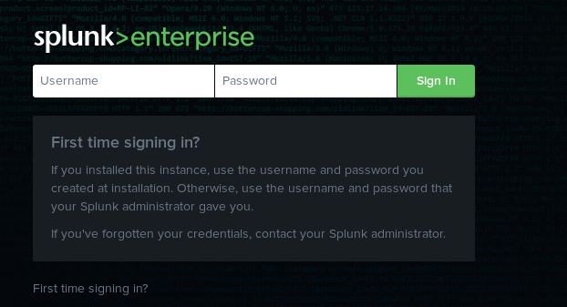

	- Enter your username and password.


### The Splunk User Interface 

In this section we introduce the **Search & Reporting Application** in Splunk. The objective of this section is to give you an overview of the functions they will learn over the next three days.

* We'll start by explaining that the **Search & Reporting Application** is the primary interface for `running searches`, `saving reports`, and `creating alerts` and `dashboards`.

* Navigate to the **Main App** tool bar by selecting the **Splunk > Enterprise** icon in the upper left corner of the web page and then selecting **Search and Reporting**  under Apps.  

	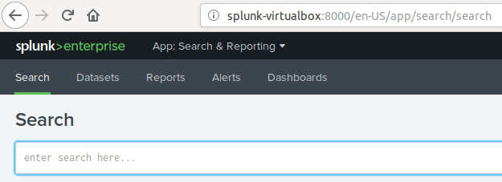

Below are descriptions of the uses of each **Main App** tool bar functions.

#### Search

* The first option on the tool bar is Search. This function provides the ability to **search events from indexed data** (e.g., Windows event logs, web server logs, live application logs, network feeds).

* Using **real-time** searches security teams search events **before they are indexed** and preview reports as they stream into Splunk. 

* Remember that: 

	* Security teams run a series of time-based searches to investigate and identify abnormal activity.

	*  The timeline is used to drill into specific **time periods** (*minutes*, *hours* or *days*) looking at events that happened around the same time to help correlate results and find the root cause.

	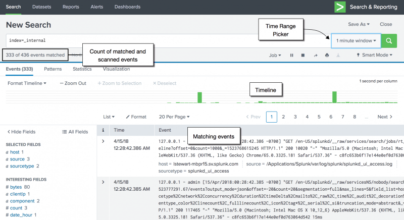	


#### Datasets 

The next option on the App tool bar is Datasets.

* A **dataset** is a collection of data that is defined and maintained for a specific business purpose.

* A dataset is used when you do NOT:

	* Know the Search Processing Language (SPL) well.

	* Want to spend time designing complicated searches.

* Datasets are created using a **Table Editor**	where event fields are selected for a search.

	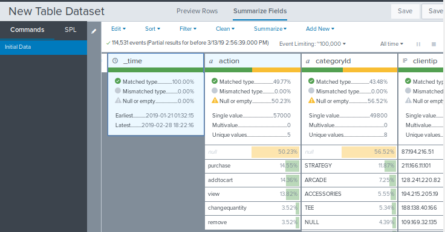	


#### Reports 

The next option is Reports.

* Reports are created when you save a search or can be created manually.

* After a report is created, they can be scheduled to run at any interval and are used in dashboards. PDF document can also be generated from reports. 

		

#### Alerts 

* Remember monitoring and alerting is a key component in Splunk. 

* Alerts are used to monitor for and respond to specific events. 

* Alerts look for events in real time or on a schedule. 

* Alerts can also be assigned a priority such as Informational or Critical.

	

#### Dashboards 

* Dashboards integrate **real-time searches**, **charts**, **reports**, **guages**, **maps** and **tables** into panels to display the most relevant information for different teams and use cases. 

* Scheduled searches are used to create real-time dashboards and visualizations.

* Some of the benefits for security analysts and SOC teams:

	* Dashboards accelerate **time-to-insight** and **time-to-action**.

	* Dashboards use the same event data for security analysts and operations teams to visualize events.

	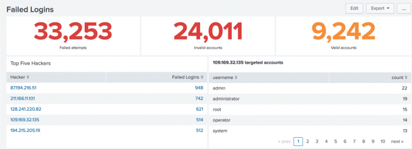


#### Getting Data into Splunk	

In this section let's discuss the various ways to bring data into Splunk. 

- **Upload** files (e.g. cvs, json, log, zip) from a system. The maximum size is 500 Mb.

- **Monitor** files and network ports on the host that runs the Splunk instance.

- **Forward** data to another Splunk instance or to a third-party system.

#### Walkthrough: Uploading a Web Log into Splunk

Next, we will demonstrate the workflow for **uploading data** into Splunk. 
The demonstration uses the `access_30Day.log` file located [here](Resources/tmp/access_30DAY.log).

* When raw data is added, the Splunk software parses that data into individual events, extracts timestamps, applies line-breaking rules, etc. 

* Events can be single or multiple lines.

	

* Let's walkthrough uploading *raw data* from a web sever log into Splunk for easier analysis. The log contains over **130,000+ lines** of purchase transactions over a 30 day period from an online game website called *buttercupgames*. 

* Notice that this log would be extremely difficult to read and analyze by hand in its raw form. 

	

#### 1. Select Source 

* First, select the **Splunk>Enterprise** logo in the left hand side of the web page. 

* Select **Add Data** icon.
	
	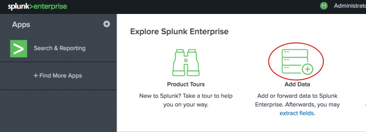


* Scroll down to see the list of common data sources and select the **Upload** icon at the bottom of the page.
	
	


* Under **Select Source**, click **Select File** to browse for the `access_30DAY.log` file *.    
	 
	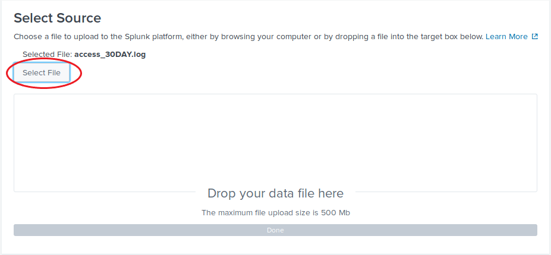

* Select the `access_30DAY.log` file and click **Open**

	* The loading status bar reads `DONE` when the upload is complete.

#### 2. Set Source Type

* Select **Next** in the workflow bar.

* Splunk automatically detects the **source type** for the file structure.  The source type for the web log is *access_combined_wcookie* which is a standardized format used by HTTP web servers when generating server log files. 

* Let's talk a little bit more about what *source types* are in Splunk:

	* Splunk assigns a source type to determine how to **format the event data** during the indexing process. 

	* Splunk comes with several well-known built-in source types for databases (`msql`), web logs (`access_combined`),  structured data (`json`), and operating systems (`syslog`).

	* Splunk also provides the capability for the creation of your own source type for customized logs.

	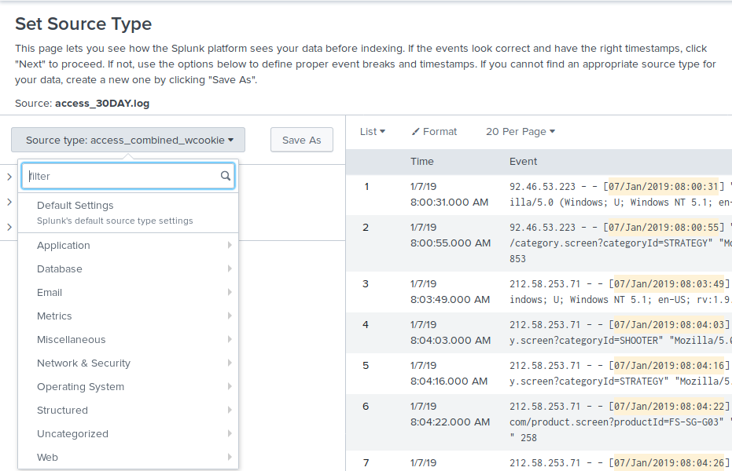

* Select **Next** in the workflow bar to assign input settings.

#### 3. Input Settings 

In this next step, we assign values for the default settings for the Host.

* A *Host* is the name of the physical or virtual devices where events originated. The host provides an easy way for security teams to **find all data originating from a specific device**.

* In our example the host is a **file**.  We want to modify the Host setting to assign the host values by using the **file name**.

	* Select the **Segment in path** button and type `1` for the segment number.	

* NOTE: Leave the `Source type` and `Index` to the **defaults**.

	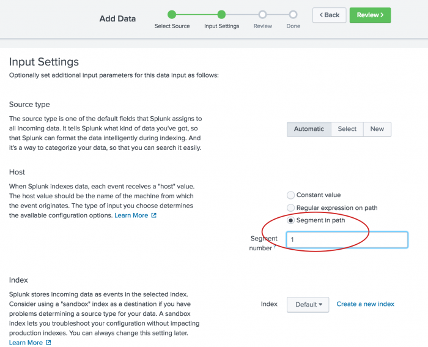

* We will select **Next** in the workflow bar to review the configuration.

#### 4. Review 

* The review page summarizes all the steps.  We can go back at any time to modify information if it is not correct.

	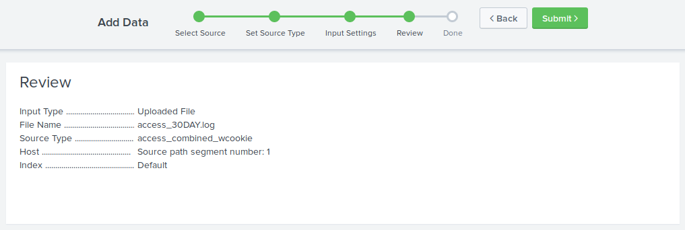

#### 5. Upload the Log File into Splunk

* Select **Submit**  in the workflow bar and then **Start Searching** to view the events.

	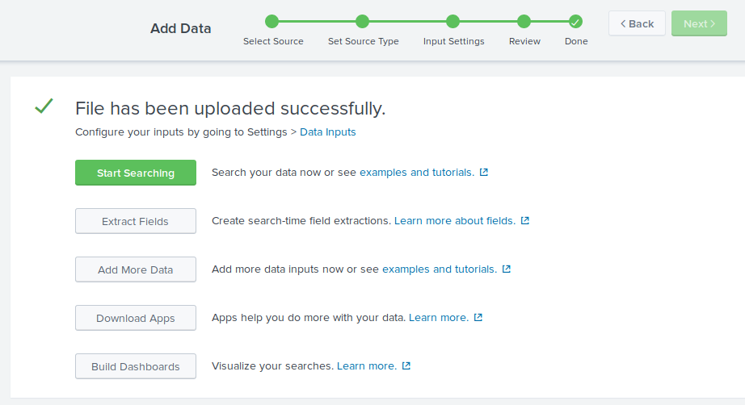

* Success! The results confirm that the data in the log was indexed and that events were created.

* Notice that the **source** = `access_30DAY.log` and the **source type** = `access_combined_wcookie`.

	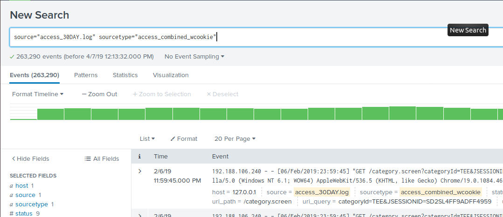


* **Key takeaways**:
  
	* We grabbed an existing log file that was created from a different machine.
  
	* We uploaded that log file into Splunk. 
  
	* We can now filter and search for different events based on our customized criteria. 
	
* Notice that when it comes to searching, quotations after an equals (=) sign are not needed, however adding the quotations makes it easier for others to read your work.  	


### Introduction to Search Processing Language

So far we've introduced the basic functions of the Search and Reporting App and how to upload a weblog into Splunk and generate events.  Now, its time for you to learn how to search events using the Search Processing Language (SPL).

#### A Quick Walkthrough: Using SPL to Retrieve Events

* Let's walkthrough the steps of a basic search using the newly uploaded `access_30DAY.log` file.

* Make sure the `Time Range Picker` is set to `All Time`.

* We will first look at a `pseudo code example` to search the log for matching events where:

  - Our *client_ip* is equal to `87.194.216.51`. 
  	
	  AND
  
  - We want to see when that client IP had the **status** that equals `200`.

* We will use the fields in the **Interesting Fields sidebar** to create the search.

* Notice that this example shows that you can create quick queries by selecting the **field names** for the search.

* Click the `status` field from the Interesting Field pane and select **Value** = `200`.

	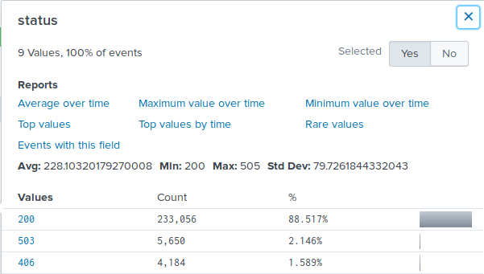

* Click the `clientip` field from the Interesting Field pane and select **Value** = `87.194.216.51`.

	* The search bar is automatically populated with the field data and the search is executed.

	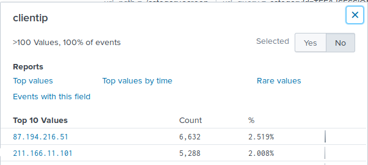

* Notice that over 5,000+ events were returned.

	


#### The Anatomy of a Search 

* The text or the **search term** in the Search bar uses the **Search Processing Language** (SPL).

* **SPL** is a language based on the **Unix Pipeline** and the **Standard Query Language** (SQL).  

	* This should look familiar to the SQL content that we covered in a previous unit. **SQL statements** were used to perform searches to retrieve information from a database.

* With SPL:

	* We are seeking to match **search terms** against segments of the data to return events from indexes.
	
	* **Search terms** use `keywords`, `field name and value pairs`, `boolean expressions`, `logical and relational operators` or `wildcards` that specify which events we want to retrieve from the indexes.

#### What is a Search Term?

Search terms can be broken up into five different categories. Let's cover them now:

#### Keywords
  
- **Keywords** are fields that have been automatically extracted from the log file that you can use for searches. 

	* These keywords have been chosen based on the frequency they show up in the log file.

- Keywords are also known as `selected` and `interesting` fields in Splunk and appear on the left hand side of the search page. 

	* Notice that on the right hand side of the field, you can see the number of instances each fields shows up in the log file, which is useful for when you are conducting searches.

**Field / Value Pairs**

* **Field/Value Pairs** match keywords and specific information that you would like to find. 


* The syntax looks like: 

	```bash
		<field> = <value>

		clientip = 87.194.216.51
	```	

* Here are some examples:

	- `user=` is the field and `Aj` is the value. This field/value pair finds the user named Aj. 

	- `domain=` is the field and `facebook.com` is the value. This pair finds the website facebook.com. 

#### Logical Operators and Boolean Expressions

 - There are three logical operators that we've covered in the past that are used in Splunk as well.

	- `NOT` For example "I want all instances of the error 403 NOT forbidden access" meaning I only want to see error 403 that are not also errors of forbidden access.  

	- `OR` For example  "I want all instances of the errors 403 OR forbidden access" meaning I want to see singular instances of one or the other.  

	- `AND` For example "I want all instances of the errors 403 AND forbidden access " meaning I want both errors.

#### Relational Operators

-  Splunk also uses relational operators.

	- The not equals operator: `!=` 
		- For example: `!= 200` mean "I want all events where the status `does not equal to 200`".

	- Greater than operator: `>` 
		- For example, `> 4` means "I want all events where the `linecount is greater than 4`".


#### Wildcards

  - **Wildcards** are used the same way as they are used in Linux. 

  -  The wildcard symbol is `*`, which matches any characters in that string. For example:

		- `you*` could match with `you're`, `young`, `your` and `youth` ...if those strings exist in the log file. 

		- `*ing` would match with `matching`,`fighting`, and `talking` ... if those strings exist in the log file. 

		- `*each*` would match with `reaching`, `breach`, and `preach` ... if those strings exist in the log file. 	
#### Boolean Expressions Demonstration

Let's take a look at an exammple of a search term that uses a Boolean expression and additional fields from the event.

* Enter this search term in the Splunk Search bar:

```bash
source="access_30DAY.log" sourcetype="access_combined_wcookie" AND "status != 200" AND method="GET"
```

* Before executing the ask yourself:

	* What are the **field/value pairs**?

	* What **operators** are used?
	
	* What **events** will this search return? 

* Click the **green** search icon to execute the search.	

**Summarize the key takeaways:**

  - Machine data that comes into Splunk is unruly and unorganized. 

  - Keywords, wildcards, and field/value pairs allows us to filter the data. 

  - Boolean expressions take our filtration techniques a step further, to more precisely get the data we need. 


---
### Copyright
Copyright 2019 &copy; Trilogy Education Services. All Rights Reserved.
