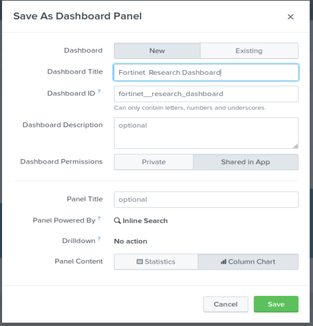
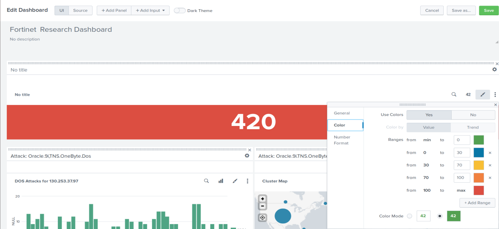
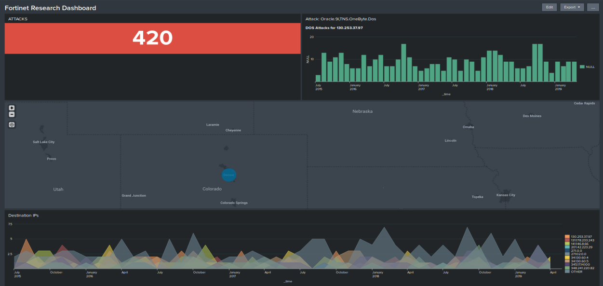

## Solution Guide: Visualizing Data from Firewall Attack Logs

### Solutions:

**Note:** Solutions may vary based on naming convention during the upload of data. 

**Time Chart**

* Create a **timechart** for the top `source IP` for the **DOS attacks by month**.  This is the search used in the instructor example shown before.

     `source="fortinet_logs_new.csv" host="splunk-VirtualBox" sourcetype="csv" src_ip="130.253.37.97 | timechart count as "attack" by day_month`

  

* **Add the timechart** to a Dashboard called `Fortinet Research Dashboard`.

     

**Attack Count**     

* Generate the `count` (420) using the `stats` command.

   * Point out that the `stats` command is used with just the `count`

    `source="fortinet_logs_new.csv" host="splunk-VirtualBox" sourcetype="csv" src_ip=130.253.37.97 | stats count`

   * Then, under the visualization tab, select `Single Value`.
   
            

* **Add the count** to the dashboard.

**Map**     

* Next, generate a map for only the top source IP. 

     * Point out that first the search is focused on the top src_ip and that output is piped to the `iplocation` and `geostats` commands.

     `source="fortinet_logs_new.csv" host="splunk-VirtualBox" sourcetype="csv" src_ip=130.253.37.97 | iplocation src_ip | geostats count`

     

* **Add the map** to the dashboard.

     * Same as the Direct Instruction

**Area Chart**     

* Generate an area chart that displays the **targets** for the attack for the source IP address.

   `source="fortinet_logs_new.csv" host="splunk-VirtualBox" sourcetype="csv" src_ip=130.253.37.97 AND dest_ip=* | timechart count by dest_ip` 
   `| sort - dest_ip`

   * Point out the `AND` and the **wildcard**

   * Title: `Destination IPs`

     

* **Add the area chart** to the dashboard.

     * Add the title: `Destination IPs`   

* Tell students to `roll over an IP address` in the list at the right of the panel to view the stats in the area chart.

**User Interface**

* Change the color of the `count` to red.

   * Point out that an element can be changed after it is generated in a search. 

   * The title for the panel is **ATTACKS**

     

* Change the background for the dashboard using the `Dark Theme` slider.

   * Tell students most SOC and NOC analyst prefer the dark background.

* Where are the attacks originating? 

   * **Answer:** Zoom in on the map. The location is `Denver`.

   
