## Digital Forensics Day 1: Introduction to the Science of Digital Forensics

### Overview

Today's lesson is part one of our discussion of the science of digital forensics. You will be introduced to procedures for collecting, preserving, analyzing, and reporting forensic evidence.

### Class Objectives

By the end of this lesson, you will be able to:

* Summarize the basic principles and methodologies of digital forensics.

* Describe various skill sets needed in digital forensics jobs.

* Outline the proper approach to collect, preserve, analyze, and report forensic evidence.

* Demonstrate how to conduct a preliminary review for a forensic case. 

* Demonstrate preserving and documenting evidence using Autopsy 4.6

#### Class Scenario:

* This week, you will participate in a small subset of the [2012 National Gallery Scenario](https://digitalcorpora.org/corpora/scenarios/national-gallery-dc-2012-attack) on the [Digital Corpora](https://digitalcorpora.org/corpora/scenarios) website, a teaching and forensic research site maintained by [Dr. Simson Garfinkel](https://simson.net/page/Main_Page). Digital Corpora is used by many universities and reputable organizations, and is free of charge. 

#### Lesson Overview

* Today's lesson is segmented into three parts: 
  
  * Introduction to the science of digital forensics
  
  * Explanation of disk architecture, disk forensics, and forensic imaging formats
  
  * Hands-on activity using Sleuthkit Autopsy to open a case for the class forensics investigation

  * There are three Guided Practice exercises

### Slideshow

- Slides for today's lessons are available on Google Drive located here: [Forensics Day 1 Slides](https://docs.google.com/presentation/d/1aP5jsJedbmWj01jL0ha-HQZOvf4N8P3FxakntKDvPDE/).

- **Note:** Editing access is not available for this document. If you wish to modify the slides, please create a copy by navigating to File > "Make a copy...".

--- 

### 1. Introduction to Digital Forensics 

#### What Is Digital Forensics?

* Digital forensics is "the process of using scientific knowledge for collecting, analyzing, and presenting evidence. Forensics deals primarily with the recovery and analysis of latent evidence."

* Digital forensics is a science. Therefore, you are using science and technology to investigate and establish facts presented in criminal or civil courts of law. 

* The goal of digital forensics is to be able to present evidence that can be used in a court of law. This goal is achieved by recovering, analyzing, and presenting data. 

* Maintaining a **chain of custody** at all times assures integrity and accountability of the investigation. This chain includes documenting every step in the investigation, showing uninterrupted control, and ensuring that evidence is not contaminated. 
- Defense attorneys, for example, will examine the chain of custody form. They will try to find mistakes to render the evidence inadmissible.

### 2. Overview of Digital Forensics Types 

Next we'll present a high-level overview of the types of digital forensics. 

#### Disk Forensics

* Disk forensics involves acquiring and analyzing information stored on physical storage media, such as hard drives, smartphones, GPS systems, and removable media. This are involves the recovery of hidden and deleted information. 

  * Disk forensics requires extensive knowledge of the inner workings of hard drives and how they store data, as well as how to salvage data from damaged or compromised devices.

#### Memory Forensics

* The goal of an attacker is to leave as little evidence on storage media. However, inspecting computer memory can identify activities on a system.

  * This area requires the highest skill set. You must have knowledge of CPU architectures, operating systems and memory management, page tables and virtual addressing, to name a few.

#### Network Forensics

* Network forensics is the process of examining network traffic, including transaction logs and real-time monitoring using sniffers and tracing. 

  * Investigators in this area have an excellent understanding of communication and network protocols and the tools needed to capture and analyze data.
 
  * Memory forensics is _different_ from disk forensics in that the data investigated is stored in _volatile_ memory, such as **RAM**. **Volatile memory** refers to storage media that loses its data when rebooted. Data on hard drives does _not_ change between reboots, so it is **non-volatile**.

#### Email Forensics

* Email forensics analyzes the source and content of an email as evidence. Email forensics includes the process of identifying the sender, recipient, date, time, and origination location of an email message. 

  * Email forensics is important when proving that people have or have not been in contact, as is often the case in conspiracy and fraud cases.

#### Mobile/Smartphone Forensics

* Mobile and smartphone forensics involves the process of capturing and analyzing the contents of cell and smartphones.

   * Cellphone forensics could be used in a distracted driving case. A forensic expert could analyze what was happening at the time of the accident. 

#### Other Forensic Areas

* There are also other forensic areas such as cloud, drone, internet, malware, and software. 

* **Digital forensics in the cloud is handled differently** from other forensic areas and poses unique challenges to securing and preserving evidence. 

### 3. Guided Practice: Digital Forensics in the Cloud 

### 4. Review of Digital Forensics in the Cloud 
  
### 5. Methodology for Conducting an Investigation 

* The Penetration Testing Execution Standard (PTES) framework provides guidance during a penetration test. Digital forensics has similar frameworks, which include the following steps:

- Prepare for the Investigation
- Collect the Evidence / Forensic Recovery
- Preserve the Evidence
- Electronic Discovery and Analysis
- Present and Report

#### Prepare for the Investigation

   * Preparation is an important first step in conducting an investigation and that there might not be very much time for it. 

   * As an investigator, you want to consider such things as whether the incident was remote or local, what laws are relevant, and what tools should be used (GUI or CLI). 

#### Collect the Evidence / Forensic Recovery

   * The success of the analysis phase depends on the collection phase.

   * During the collection phase, the investigator makes decisions about what data to collect and the best way to collect it.

   * During forensic recovery, evidence is extracted from a device and a master copy is made. 

   * How you collect the evidence determines if the evidence is admissible in court.

#### Preserve the Evidence

   * Investigators never work on the original copy of evidence. A read-only master is made and stored in a digital vault. All processing is done on the copy. 

   * A **cryptographic digest** is made to ensure that evidence has not been altered in any way.

#### Electronic Discovery and Analysis

   * Analysis is done after data has been collected. This is sometimes referred to as **dead analysis**.

   * Document everything including time, date, applications used, etc. Your evidence must be able to be reproduced; if not, it may be ruled as inadmissible.

#### Present and Report

   * In this phase, investigators write an expert report that lists what tests were conducted, when and how they were conducted, what was found, and the investigation conclusions.

   * You may be called to testify as an expert witness in a trial or deposition.

### 6. Introduction to the Case at the 2012 National Gallery 

By now, you should be ready to dive into the class investigation. The investigation revolves around the [2012 National Gallery Scenario](https://digitalcorpora.org/corpors/scenarios/national-gallery-dc-2012-attack). 

* Below are the high level details :

   * The scenario is centered around an employee at the National Gallery DC Art Gallery with plans for both theft and defacement.

   * Suspicious activity was reported to law enforcement and devices were seized, including images of hard drives and both logical and physical images of mobile devices. 

   * The seized evidence has been processed by the ingest team at the Crime Laboratory. 

   * The evidence has been backed up using the Encase forensic application.

### 7. Guided Practice: The Case of the 2012 National Gallery 

### 8. Review of the Case of the 2012 National Gallery 

### 9. Introduction to 2012 National Gallery Evidence 

The last page of the 2012 National Gallery scenario describes the **storage devices** that were imaged as evidence. In this section we'll cover a general overview of the physical layout, disk imaging, and disk image formats.

* The seized evidence included an iPhone and a tablet. These have storage devices that hold operating and filesystem data, applications, documents, pictures, videos, and music.

#### Overview of Storage Media

* Different storage devices and storage requirements:

   * **Optical devices** such as CD-ROMS, DVDs, and Blu-Ray. They are used for mobile storage and hold from 700 MB to 50 GB of data.

   * **Hard disk drive** (HDD) used in computer devices and store up to 16 terabytes of data.

   * **Solid-state drives** (SSD) can store up to 16 terabytes of data.

   * **SD cards** used in smartphones (e.g., Android) and store up to 512 GB of data.

#### Mechanical Hard Drives (HDD)

* Mechanical hard drives were developed in 1956 by IBM. 

* Hard drives have an **actuator**, **actuator arm**, **platter**, and **spindle**. 

* Data is read/written by the the actuator arm and attached head moving back and forth across the spinning platter. 

   * Data is stored in a series of concentric circles called **tracks**, and then tracks are broken up into **sectors**. Information about what sectors are free or used is stored in a **file allocation table (FAT)**.

* **Implications for Forensics**:

   * Data can be recovered from badly damaged or comprised devices. This requires extensive knowledge of the inner workings of hard drives and how hard drives store data.

#### From Mechanical Devices to Flash Storage Media

* A hard drive is limited by the speed at which it can receive and send information.

* Flash storage devices **do not have moving parts** but use **flash memory**, which allows for quicker access. 

* **Flash memory** or **flash storage** holds data even when it's not connected to power (like read-only memory). It is **non-volatile** storage. This technology is used in devices such as USB drives, mobile phones, cameras, and tablet computers.

**Solid-State Drive (SSD)**

* SSD storage devices use flash memory chips.

* **Implications for forensics**: 

   * An SSD is **not** a mechanical drive. You must be careful with the forensics tools used to image and recover data. The data on an SSD can be lost or wiped out within seconds.

**SD or MicroSD Cards**

* SD cards store data inside a flash memory chip similar to solid-state devices. They are used in cell and smartphones.

* **Implications for Forensics**:

   * It is possible to retrieve data from an SD card even if it has been formatted or the data has been deleted. This is because data is not immediately erased; the storage is set aside for reuse. As long as the slot has not been used, it is still available. This is great for forensics recovery.

#### Physical vs. Virtual Drives

* In disk forensics, you will analyze data from physical and virtual drives.

* A **virtual drive** resides on a physical drive and emulates the characteristics of a hard drive. The drive can be mounted and dismounted, and data can be read and written to it. 

#### File Systems

* You will work various file systems during investigations. Below is an overview of systems used in Windows, Mac, and Linux systems:

  * **New Technology File System (NTFS)** is supported under Windows 10, 8, 7, Vista, XP, and NT

  * **File Allocation Table (FAT)** system is supported by older and newer versions of Windows

  * **Apple File System (AFS)** is used by Mac OS systems

  * **Fourth Extended File System (Ext4)** is used in RedHat, Kali, and Ubuntu

#### How Was Evidence Obtained in the Case?

Let's return to the case and cover how the data was captured.

* The evidence was gathered from the iPhone and saved in the Encase Eyewitness Format (*.E01*) as a **disk forensic image**. 

#### What Is a Disk Forensic Image?

* During an investigation, it is important that evidence is not contaminated. As a forensic investigator, you will **image** the data. This image—not the original media—will be used for analysis.

* Acquiring data for an image involves performing a **bit-level-copy** of the entire physical data store. 

  * A **basic file system copy** is inadequate for forensic analysis. If you do a copy through the file or operating system, you can see only the data that the operating system sees. This won’t capture deleted files or slack space. You need to obtain a **bit-level copy**. 

     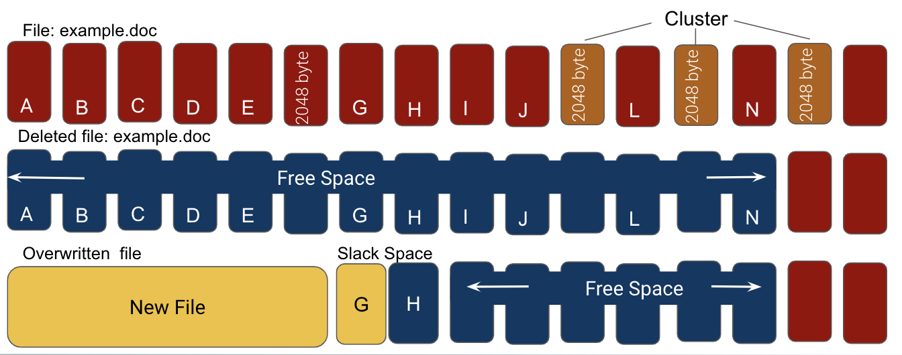

#### Forensic Disk Image Formats

Other disk imaging formats:

* **Raw Formats:** This formats can be created with programs such as `dd`, `ddfldd`, and `ddcdd`.
  * .bin
  * .dd 
  * .img 
  * .raw

* **Advanced Forensic Format (AFF):** The AFF format is for disk images and related forensic metadata. It was originally developed by Simson Garfinkel and Basis Technology.
  * .AFF 
  * .AFF4

#### Samples of Image Files

* Navigate to https://www.cfreds.nist.gov/ at the National Institute of Standards and Technology. 

* There you will find **mobile, hacking, drone, and memory images** that can be used for future work.

### 10. Break 

### 11. Direct Instruction: Introduction to Autopsy 

Now that you've have an overview of the different types of storage mediums and forensic image formats, it's time to learn the software you will use to **analyze the image file**.

* You will be using the [Sleuthkit Autopsy](https://sleuthkit.org/autopsy/docs/user-docs/4.3/index.html) forensic application.

  * **Autopsy** is an open-source graphical tool that runs on Windows, Ubuntu, Kali Linux, and OS X platforms.

  * You will run Autopsy using the **Kali Linux** operating system.

* Many other forensic software exists, including:

  * [**AccessData Forensic Toolkit** (FTK)](https://accessdata.com/products-services/forensic-toolkit-ftk): a proprietary system that only runs on Windows

  * [**OSForensics**](https://www.osforensics.com/): a proprietary system that only runs on Windows

  * [**Open Computer Forensics Architecture**](http://ocfa.sourceforge.net/): an open source system that runs under the Suse and Ubuntu operating systems

* Additionally, there is also mobile forensics analysis software such as:

  * [UEFD Cellebrite](https://www.cellebrite.com/en/products/ufed-ultimate/).

  * [Oxygen Forensic Suite](https://www.oxygen-forensic.com/en/)

  * [BlackBag Technologies Analyze](https://www.blackbagtech.com/software-products.html)

  * [Paraben](https://paraben.com/forensic-impact/)

#### Prepare the Data

Now we'll prepare the data, using the image of Tracy's iPhone

* First, you would run a **virus scan** on the image. (This takes time, so you won't be doing it during class.) If any virus files are found during a virus scan, they should be documented. 

* Next, generate **md5** and **sha256** hashes for the evidence. This will be used to validate that nothing was changed during the investigation.

* Open a terminal window in Kali Linux and navigate to the `/corpus` directory. 

  * Run `md5sum tracy-phone-2012-07-15.final.E01 > tracy.original.md5log.txt`

  * Run `sha256sum tracy-phone-2012-07-15.final.E01 > tracy.original.sha256log.txt`

* Note that that the file has an .E01 extension, which means it is in Encase image format.

#### The Autopsy Workflow

The software has a lot of features, but we will cover the following steps in the Autopsy workflow:

  1. **Create a case**: Case name, investigator information, and optional information

  1. **Add an image**: Autopsy supports Raw, Encase, and Virtual Disk image formats

  1. **Configure ingest modules**: For example, Email Parser, Embedded File Extractor, Android Analyzer

  1. **Ingest in progress** (This will take some time.) 

  1. **Manual analysis**: Analyze data 

  1. **Create timeline**: Time, data, and data source

  1. **Report**: Format (HTML, Excel)

#### Create a Case

Creating a Case:

1. Open the application menu on the bottom left of the tool bar. 

1. Type Autopsy and click on the application to start it. 

1. The splash screen displays. Select **New Case**.

  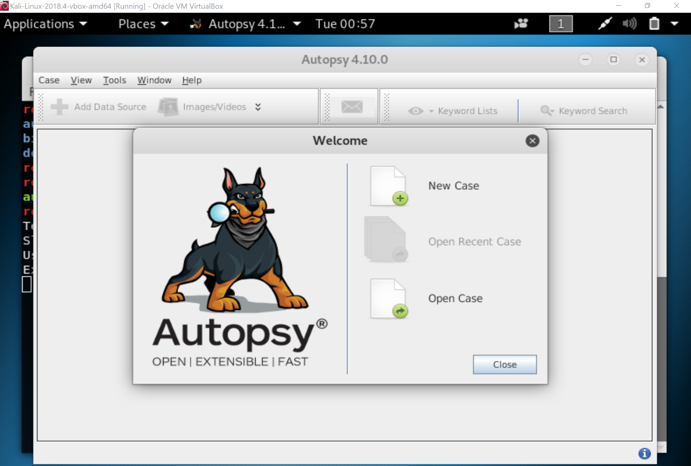

#### Step 1: Set Up the Case Information

1. Enter the **Case Name**: 2012-07-15-National-Gallery

1. Enter the **Base Directory**: /root/cases/

1. Enter the **Case Type**: Single-user

1. Click **Next**. 

   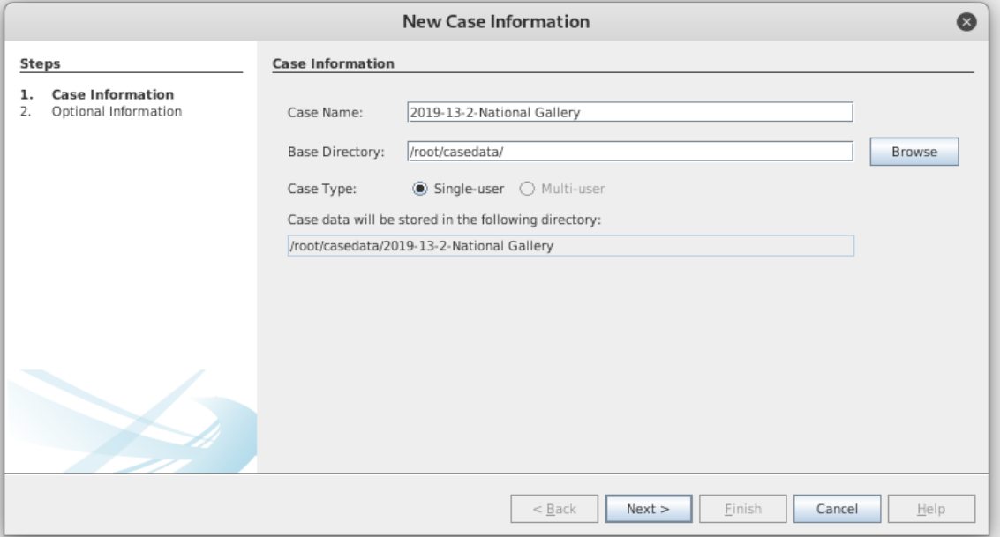

Next, enter Optional Information:

* Enter a **Case Number**: 1Nat347B

* Enter **Name**, **Phone**, **Email**, and **Notes**. _(optional)_

* Select **Finish**.

Next, you will add evidence and configure ingest modules.

#### Step 2: Select Types of Data

* Select **Disk Image or VM File** and click **Next**.

  

1. Browse to where the evidence files are located at */corpus/*.

1. Select *tracy-phone-2012-07-15-final.E01*.

1. Select an **E01 file** and **Open**.

1. Select a **Time zone**.

1. Click **Next**.

  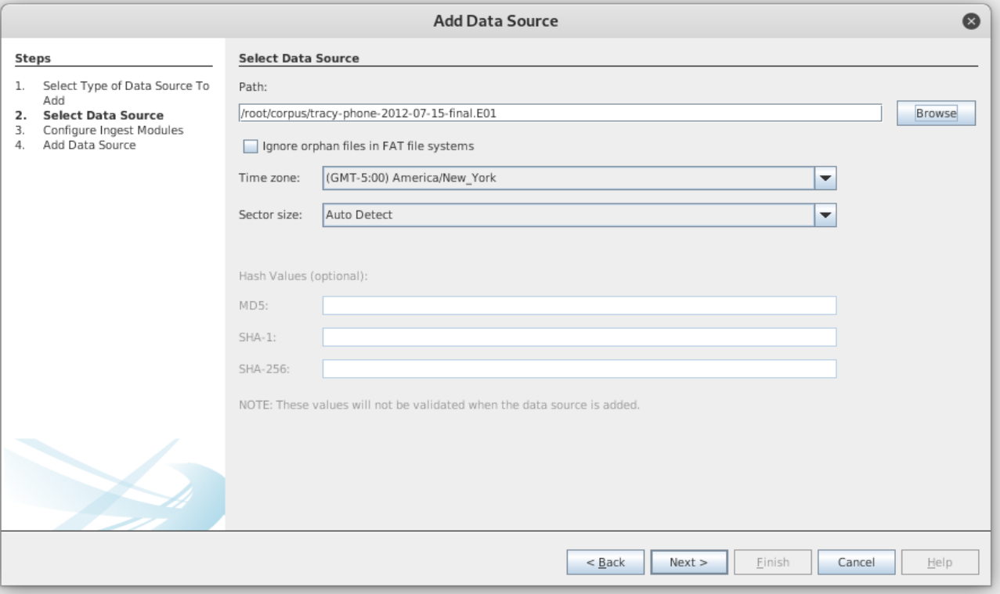

#### Step 3: Configure Ingest Modules

**Hash Data Sets**

* We can configure the following

#### Additional Ingest Settings

* Set the additional option using the following Extension Mismatch Detector and Keyword Search settings:

#### Extension Mismatch Detector 

* The Extension Mismatch Detector uses the results from the File Type Identification and flags files that have an extension not traditionally associated with the file's detected type. 

* It ignores "known" files.

  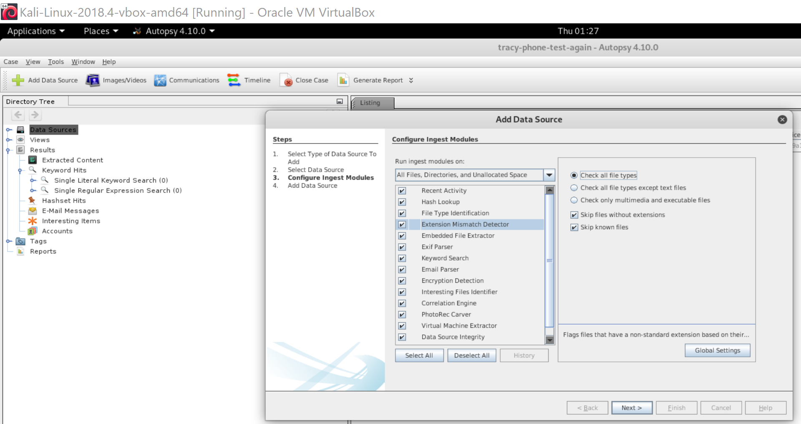

#### Keyword Search

* Autopsy tries to extract the maximum amount of text from the files being indexed. The indexing will try to extract text from supported file formats, such as text files, MS Office documents, PDF files, email, and many others.

  * **Note**: The more items you select, the LONGER the ingest process will take.

  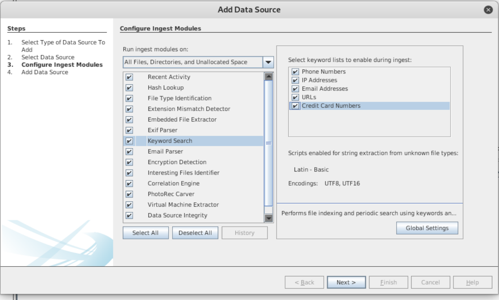

* Select **Finish**.

* The files are now being analyzed by Autopsy. When this process is finished, the file is ready. 

* This will take some time. The status is shown in the bottom right of the window. You can click in the progress bar to see the status.

  

#### Step 4: Run a STIX Scan Against the Evidence File

In this step, you will select one or more **Structured Threat Information Exchange (STIX)** files to run against the evidence. This process reports which indicators were found in the data source. This will generate files of interest in Autopsy.

* For more information, please see documentation at:

  * https://sleuthkit.org/autopsy/docs/user-docs/4.3/stix_page.html

  * https://oasis-open.github.io/cti-documentation/stix/examples.html

  * https://oasis-open.github.io/cti-documentation/

  * https://stix.mitre.org/language/version1.0.1/samples.html#simple

* There are several sample STIX watch list files in the corpus database for IP addresses, URLs, phishing, and file hashes. The samples are written in XML. These are for demonstration purposes only. 

To select the STIX file:

1. Select **Generate Report** from the top menu.
 
1. Select the **STIX** radio button. 

1. Navigate to the location of the STIX files.

1. Select the *STIX_Phishing_Indicator.XML* file and select **Finish**.

   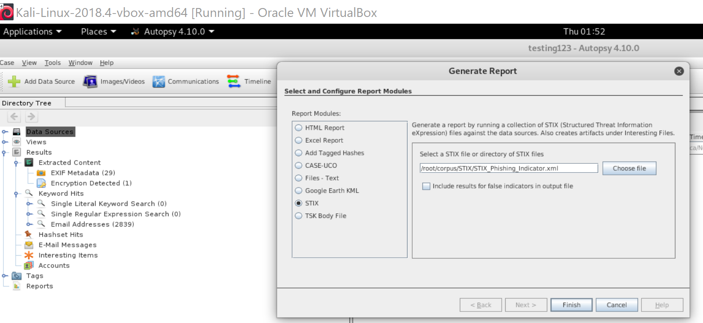

To view the report:

* On the left navigation, under **Tags**, select **Reports**.

   If there are items of interest, they will be displayed in the **Report**.

   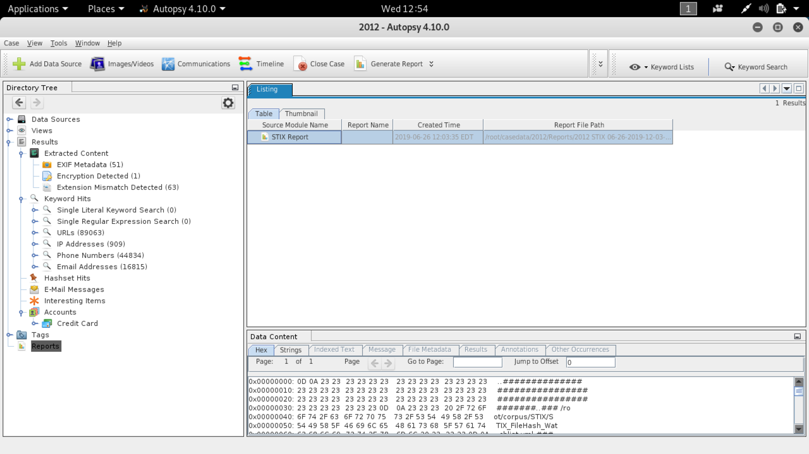

 #### Step 5: View Output from Autopsy

 * Next, view the iPhone image file in Autopsy.

 * Note that the iPhone has a user partition that is encrypted.
 
   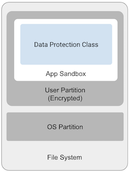

 * Since the device uses encryption, you will find data in the **Encryption Detected** area in the image file.

   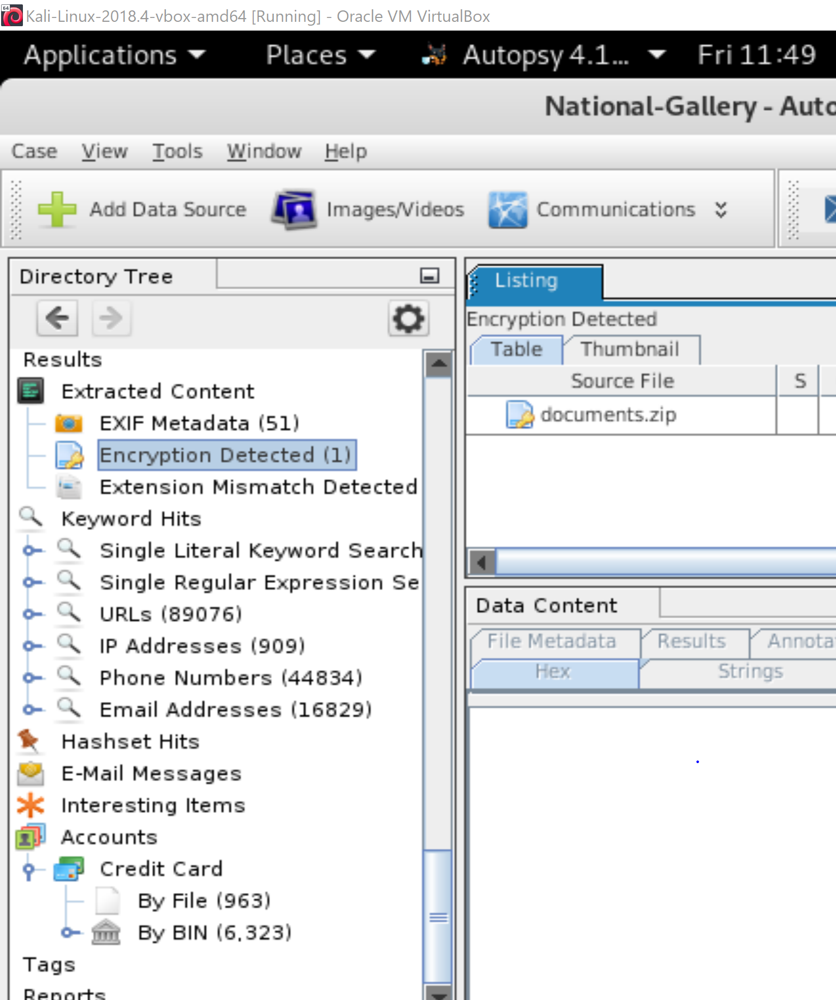

#### Access the Encrypted Data

 1. Select the **Encrypted Detected** entry.
 
 1. The **Listing** pane will show the *documents.zip* file.

 1. Select the *documents.zip* file and the directory tree will populate with the iPhone image content.

   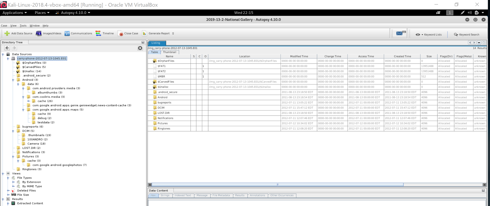

### 12. Guided Practice: Introduction to Autopsy 

### 13. Review of Introduction to Autopsy 

-------

© 2020 Trilogy Education Services

