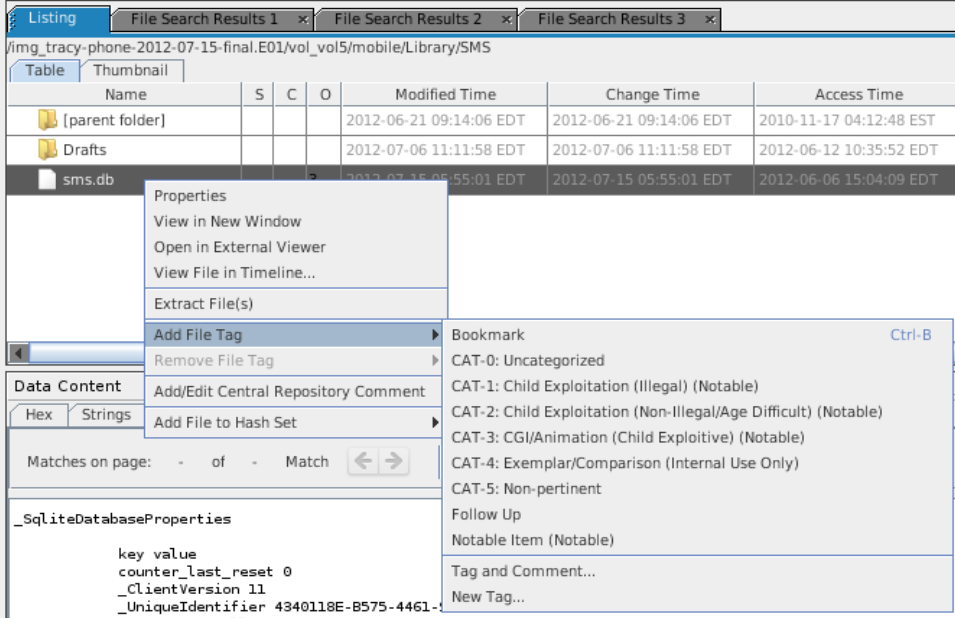
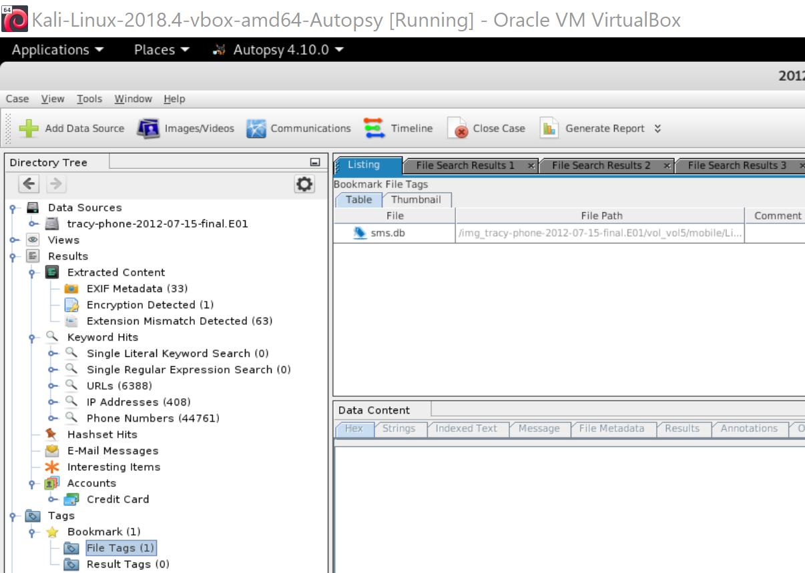
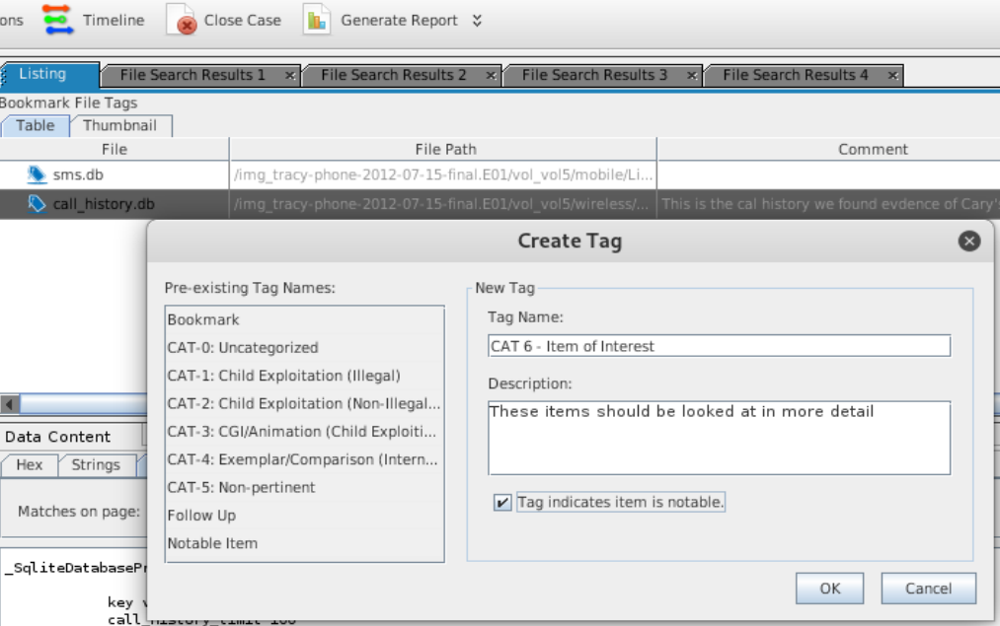
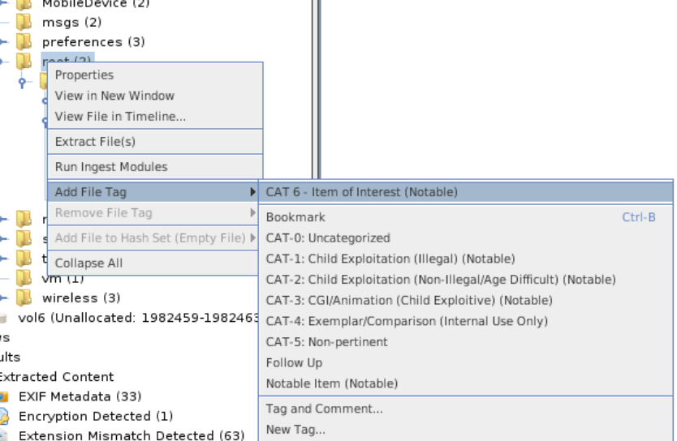
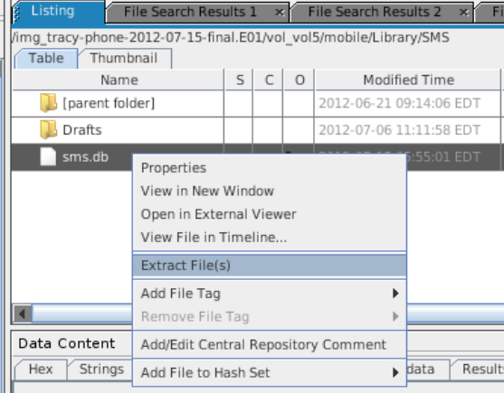
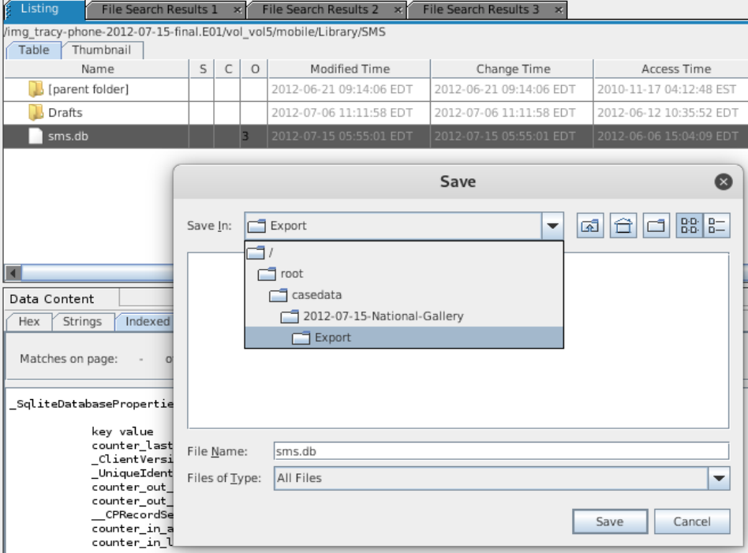
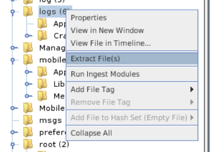

## Digital Forensics Day 2: Autopsy and iPhone Forensics

### Overview

Today's lesson is the second part of our introduction to the science of digital forensics. You will use the Autopsy interface to analyze an iPhone image.
 
### Class Objectives

By the end of this lesson, you will be able to:

* Identify the methods used in smartphone forensics investigations.

* Describe the database and file structure of the iPhone's flash drive.

* Locate identifiable evidence on the iPhone in order to establish ownership.

* Use Autopsy to view and tag evidence in an iPhone image.

* Extract image content for offline viewing in other applications (logs, text, pictures, video, audio).

### Lesson Breakdown

* Today's lesson is segmented into three parts: 

  * Review of creating an Autopsy case and the User Interface
  
  * A look into mobile forensics and the structure of the iPhone
  
  * An investigation activity that analyzes the iPhone image for device information and examines Tracy's email correspondence

### Slideshow: 

- Slides for today's lesson can be found on Google Drive here: [Forensics Day 2 Slides](https://docs.google.com/presentation/d/1aZvzH4kUlv2cUb0onBlD0PGhVIZV7jBqm84d3Rdno4o/edit).

- **Note:** Editing access is not available for this document. If you wish to modify the slides, please create a copy by navigating to File > "Make a copy...".

---

### 04. What's in Tracy's Phone? Intro to iPhone Forensics (0:20)

Overview of mobile forensics and the iPhone's file structure and major directories.

* Mobile forensics involves the process of searching the contents of cell phones, smartphones, and tablets.
	
	* Investigations using mobile forensics include driving accidents while texting, determining the movements of a suspect, and reviewing text message in a missing persons case.

#### What's an iPhone?

* The iPhone was first released in June of 2007 and runs the iOS operating system (Unix).

* There are currently 700 million iPhones in use as compared to 2.3 billion Android phones.

* The device supports mobile, WiFi, and Bluetooth and includes applications such as email, calendar, SMS texting, and iTunes.

* iPhone phone data is **encrypted** and has been involved in several high profile forensic cases.

#### Where's the Data? File System and Data Storage

An important aspect in mobile forensics is understanding where data is stored, how to access the data, and what data can be recovered.

* The iPhone does not have external storage. All data is stored in **flash memory** on the device.

	* Flash memory maintains data without any external power and is used in SSDs and smartphones.
	
	* With flash memory, data on the iPhone exists until it is overwritten.
	
* On the iPhone, the flash memory contains two disk partitions:
   
   * The **root** partition is used for the operating system and applications.
   
   * The **var** partition is used for user data.

* Data is first imaged using a **bit-level-copy**. In the iPhone, this will recover deleted text and messages as well as GPS coordinates and cell tower locations.

* The iPhone allows users to back up their data to the cloud. This can be another source of data in an investigation, especially when the device is not available.

#### Important Directories / Databases and Files

* The */mobile*, */Applications*, */Library*, */root*, */Logs*, and */logs* directories contain evidence for the investigation. 

* iOS is based on Unix and navigating the directory structure should be familiar territory.

* Most information is in human-readable format within the Autopsy application.

* The iPhone stores user data in **SQL databases** and other files. 
	
	* SQL stands "Structured Query Language* and is a language used to read, write, and update database files.

	* A **database** is used to stored information, such as an address book. 

* Below are the main databases that applications such as mail, SMS, calendar, and the address book use:

	* **AddressBook.sqlitedb** contains contact information and personal data like name, email address, etc.

	* **AddressBookImages.sqlitedb** contains images associated with saved contacts.
	
	* **Calendar.sqlitedb** contains calendar details and events information.
	
	* **CallHistory.db** contains incoming and outgoing call logs including phone numbers and time stamps.
	
	* **sms.db** contains text and multimedia messages along with their timestamps.
	
	* **voicemail.db** contains voicemail messages.
	
	* **Safari/Bookmarks.db** contains saved URL addresses.
	
	* **Envelope Index** contains the email addresses on phone.

	* **consolidated.db** contains GPS tracking data.

	* **locationd** contains the Google coordinates of places.

* The iPhone also has data stored in **plists**, or **property lists**. A plist stores configuration information, call history, and cache information (i.e., what websites were visited).

	* **Maps/History.plist** keeps keeps track of location searches.
	
	* **Maps/Bookmarks.plist** contains bookmarks.
	
	* **Safari/History.plist** contains internet browsing history.

* **/logs** and **/Logs** contain device information.

### 05. Is This Tracy's iPhone? (0:10)

In the next activity, you will analyze the contents of Tracy's iPhone image to begin to establish their case. **The goal ofthis activity is to establish the owner of the device**.

* Use Google to look up how the following device information is used to identify a phone:

	* International Mobile Equipment Identification (IMEI) number
	
	* Integrated Circuit Card ID (ICCID)

* Use [*Stu_iPhone-Image-FileLayout.pdf*](Activities/Stu_Evidence_1/Unsolved/Stu-iPhone-Image-FileLayout.pdf) for information on the main databases and files covered in this direct instruction.	

* Note that text is viewed using the **Indexed Text** tab in the **Data Content** pane.

* It is important to capture the file metadata using the **File Metadata** tab.

* **Note:** Most of the evidence for the investigation is located in the *vol5/mobile/Library/Logs/AppleSupport/general.log* directory.

#### Information of Interest on Tracy's Phone

* In the activity you will be looking for the following information on the iPhone image:

	* MD5 hash of the iPhone disk image

	* Device information
 
   	* Device model

   	* Device serial number

    	* OS Version #

    	* Installation timestamp
	
    	* Integrated Circuit Card ID (ICCID) number

    	* International Mobile Equipment Identification (IMEI) number - they will need to use Keyword Search in Autopsy to find this, it is not in the standard log files.

	* Tracy's personal information

    	* Tracy's phone number

    	* Tracy's email address
 

### 06. Guided Practice: Is This Tracy's iPhone? 

### 07. Review Is This Tracy's iPhone? 

### 08. Break 

### 09. Tagging Evidence

Autopsy includes a feature to **tag** evidence. This allows investigators to easily find evidence in the image later.

* The application comes with pre-defined tags for **Follow Up**, **Notable Item**, and **Child Exploitation**.

* New tags can also be added to the Tag database.

#### Add a Bookmark

* How to **bookmark** the *sms* database.

    * Locate the **sms.db** file in the iPhone image using the **Tools->Files Search by Attributes**.

    * Click on the **sms.db** entry in the **Listings** pane.

    * Right-click and select **Add Tag** -> **Bookmark**. The line containing the sms.db entry will turn yellow in the Listing pane. 

    

* The bookmark entry can be found in the **Directory Tree** under **Tags**.

    

#### Add a New Tag to the Tag Database

* A company may have a **tagging scheme** that can be used in Autopsy.

* How to **create a new tag** in the database.

    * Right-click and select **Add Tag** -> **New Tag**. The **Create Tag** window is displayed to add a new tag and comment.

     
    
* The new tag entry can be found in the **Directory Tree** under **Tags**.

* The new tag can be used to tag other evidence in the image file.

     

### 10. Guided Practice: Tagging Evidence 

### 11. Review of Tagging 

### 12. Extracting Evidence for Offline Analysis

While Autopsy has facilities for viewing information in the application, some investigators may extract the entire Directory Tree for offline viewing. 

- Offline extraction is much easier for viewing video and pictures. 
- Not all data can be viewed with a text editor. 
- The databases are viewed using SQLite or any SQL software. 

In this section, we will extract a file or an entire directory for viewing within Kali Linux or another operating system. The data can be parsed for specific information.

* The iPhone image file contains directories and files that can be viewed in the Linux file system.

* When using the **Extract File(s)** feature, one file, an entire directory, or the entire image file can be exported as a Linux directory. 

#### Export One File

* Select the **sms.db** database. Right-click and select **Export Files**.

    

* By default, files are placed in the **Export** directory for the case.

    

* The **Export** directory is located in the `casedata` directory

      

* This file can only be viewed with a SQL application.

#### Export an Entire Directory

* Select the **vol5/logs** directory in the **Directory Tree** pane.

* **Right-click** and select **Export Files**, and export the **entire directory** to the **Export** directory in Kali.

    

* Open a new terminal window and navigate to the **Export** directory that contains the extracted directory.

    

* View the **lockdownd.log** file in the nano editor.

    

### 13. Guided Practice: Extracting Data for Offline Analysis 

### 14. Direct Instruction: Review Extracting Data for Offline Analysis

-------

© 2020 Trilogy Education Services

