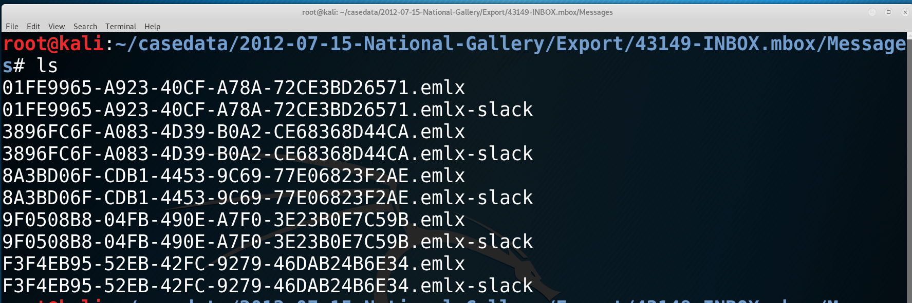
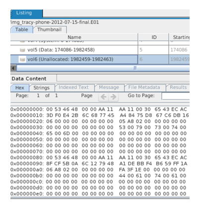
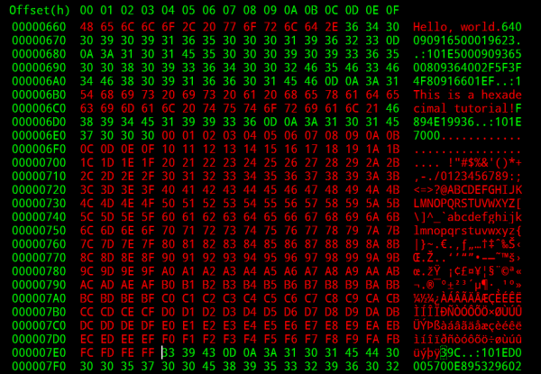
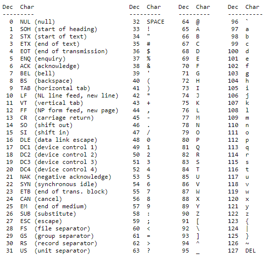
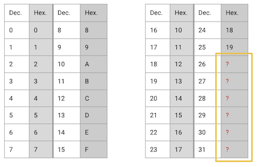
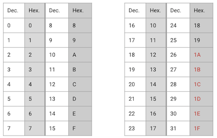
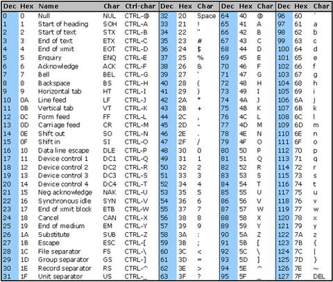

## Digital Forensics Day 3: Handling Evidence 
 
### Overview
  
Today's lesson is part three of our discussion of the science of digital forensics. You will continue the investigation of Tracy's iPhone by examining emails, text messages, and web history. They will also produce a preliminary log and report on the evidence found.

### Class Objectives

By the end of this lesson, you will be able to:

* Use Autopsy to view and gather data from emails. 

* Analyze SMS messages data offline. 

* Decode hex data in the iPhone image.

* Prepare a preliminary report using the *Group Evidence Worksheet*.


### Slideshow 

- Slides for today's lesson can be found on Google Slides: [Forensics Day 3 Slides](https://docs.google.com/presentation/d/1ULJGR7vXnsp2oJJZ12OY9Pf3gjm4PuuDFpR8MDrYxXg/). 


- **Note:** Editing access is not available for this document. If you wish to modify the slides, please create a copy by navigating to File > "Make a copy...". 

---

### 1. Introduction 

### 2. Guided Practice: Warm-Up Activity 
	
### 3. Review of Warm-Up Activity 

### 4. What's in Tracy's Emails? (0:10)

Follow along with the demo, which will display the email messages in the `INBOX.mbox/Messages` folder. These emails were exported to the `INBOX.mbox/Messages` folder in Kali Linux during the warm-up activity. 

#### Examine Emails in Kali Linux  

1. Open a terminal window and `cd` to the directory that contains the `INBOX.mbox` directory.

    
	
1. `cd` to the `Messages` folder and display the `.emlx` files.

    


### 5. Guided Practice: What's in Tracy's Emails? 

### 6. Review of What's in Tracy's Emails? 

### 7. Who Is Tracy Texting? 

Now we'll view the **SMS messages** that were sent in Tracy's iPhone.

* SMS stands for _short message service_ and is a person-to-person communication method. 
    
    * SMS messages can be no more than 918 characters.

    * SMS messages have been used in DoS attacks.  

* How to view the SMS entries in the iPhone image.

    * From the **Tools** menu, select **File Search by Attribute**.

    * Click the box next to **Name** and type **sms.db**. 

    * Click the **Search** button.

    * Select **sms.db** from the **Listing** pane. 

    * Select the **Indexed Text** tab in the **Data Content** pane to see Tracy's messages. 

* This is a database file. You can copy the text in the **Data Content** pane and create a file in Kali to better view the messages.     

     


### 8. Guided Practice: Who Is Tracy Texting? 


### 9. Review Who Is Tracing Texting? 

### 10. Break 

### 11. Decoding Hex Data in Tracy's iPhone  

We have previously viewed the data in an **ASCII**  format in the Encase image using the **String** and **Indexed Text** tab in the `Data Content` pane. However, there will be times that data will only be viewed in **Hexadecimal format** and not available in readable **ASCII**.

* This data is viewed through Autopsy using the **Hex** tab which uses a **Hex** editor to display the raw data.

    

### Why is Hex Important?

Recall that we encoded different character formats from our Cryptography unit. We'll provide a brief refresher:

* All data on a computer (photos, documents, messages, etc.) is stored as binary `1s` and `0s`. 
    
    - These `1s` and `0s` are an inefficient method of storing and displaying this data, so they are encoded into compact and readable formats. 

    - Simply put, hexadecimal numbering is the most common and efficient representation for encoding the `1s` and `0s`. We'll pick back up on this soon. 

* As it pertains to our forensics investigation, the ability to read a **hex dump** will allow us to explore a whole new space of evidence they could not read in the browsing data.    

      

* Some contributing factors of why Hex is so useful:

    * Hex is used to display the location in memory at which data is stored. 

    * Hex is used to encode binary data ,such as `executable code` in a memory dump or a `malicious document` embedded in an image or network log.
       
    * Inspecting hex data allows an analyst to determine if Tracy attempted to `delete emails` in order to hide evidence.

    * And as covered previously, hex stores characters in a computer very efficiently.

### Character Encoding Basics

* In order to fully understand the principles of reading and decoding the Hexadecimal system, we need some background knowledge on two other fundamental systems: ASCII and the Decimal System.

* First, we can visualize the characters that represent a computer's data by using a special code or `cipher`. These `ciphers`  generally have a `lookup table` we use to interpret the meanings of encoded texts:

    **Example:**

    ` plain alphabet : a b c d e f` 

    ` cipher alphabet: p h q g i u`

    Message: `abc` ->  `phq`.  

### The ASCII Character Set  

* The **ASCII character set** is used to represent characters stored in our computers in a human-readable form. 

    - For example, every character you see on your keyboard is part of the ASCII system: Upper/lower case letters, numerical digits, special characters (!@#$% etc.)

* ASCII stands for **American Standard Code for Information Interchange** and was first developed as a telegraph code.

### The Decimal System

* In the **decimal number system** we use `ten symbols` to represent the values.  It's a `base 10` system with the `base numbers` ranging from `0-9`.  

    ```bash
    0 1 2 3 4 5 6 7 8 9
    ```

* We use the decimal number system in our day-to-day life, for phone numbers, dates, scoring in sports, etc.. 


### ASCII - Decimal Encoding


* Navigate to the `ASCII character set` (**cipher**) using **decimal numbers**. [*Ascii Chart*](https://www.cs.cmu.edu/~pattis/15-1XX/common/handouts/ascii.html)

     

* The **ASCII characters for numerical digits** start at the decimal number `48` and end at `57`.

    **In other words**: 48 (ASCII) = 0 (Decimal), 49 (ASCII) = 1 (Decimal), 57 (ASCII) = 9 (Decimal)
 
* The **ASCII upper letters** start at the **decimal number** `65` and end at `90` in the ASCII table.
 
    **In other words**: A (ASCII) = 65 (Decimal),  (ASCII) B = 67 (Decimal), (ASCII) Z = 90 (Decimal)

* The **ASCII lowercase letters** start at **decimal number** `97` and end at `122`.

    **In other words**: a (ASCII) = 97 (Decimal),  (ASCII) b = 98 (Decimal), (ASCII) z = 122 (Decimal)

* Special character are also represented in the list.

    **For Example**: ! = 33, & = 38, ^ = 94, ? = 63

* How the ASCII character set cipher works.

    * ASCII `Characters` are exchanged for the `decimal numbers`.  
    
        For example: 
    
       `decimal:    65  66   67   68  69`
        
       ` ASCII:`     `A`  `B`  `C`   `D`   `E `

### ASCII - Decimal Demonstration

Use an online converter tool located here: [*Ascii-Decimal-Converter*](https://www.binaryhexconverter.com/ascii-text-to-decimal-converter).

* Enter the letters `ABCDE`.

* Enter the character numbers `1`, `2`, `3`.

* Enter your first name 


### Along Came Hex

Data can more efficiently be stored and represented by encoding using the **hexadecimal** number system. 

* The hex system uses `16 symbols` to represent the base values. It's a `base 16` system with the `base numbers` ranging from `0-9` and then the letters `A-F` to represent `12-16`. 


    ```bash
       base 16: 0 1 2 3 4 5 6 7 8 9 A B C D E F
    ```   

### Counting in Hex


  

* Using the slide chart, compare the 10 symbols  used for the decimal numbers `0 - 15` and the 16 symbols used for hex numbers for the numbers `0 -15`.

* When we get to a number greater than `F` we treat it just as we would when we reach `9`.  The sequence repeats with a new digit added to the tens place. 

    - For Dec: `8`, `9`, `10`, `11`, `12` `...`

    - for Hex: `E`, `F`, `10`, `11` `...` 

* When we get to Decimal `19`, the sequence repeats with the next digit (2) in the tens place: `20`, `21`, `22` `....`. 

    * When  we get to Hex `19` in we roll up to `1A`, `1B`, `1C` ... because we use the letters `A - F` when we reach `9`.

      


- Hexadecimal is the preferred system of the three encodings we just looked at. Simply put, when converting extensive binary representations of data into a more compact format, hex is the **most** compact. 

### ASCII-Decimal-Hexadecimal Demonstration

You can find the ASCII-Decimal-Hex table here: [ASCII-Dec-Hex Table](http://www.asciitable.com/)



* Note the following relationships between the three systems:

    * When we get to `1F`, we roll up to `20` in Hex. `20` hex is a `space` character in the Ascii table.

    * The ASCII characters are still the same, but the `cipher` is different depending on if we are using the `decimal number system` or the `hex number system`.

    * The capitol `A` in the decimal number system is `65`.
    
    * The capitol `A` in the hex number system is `41`.

* You can also use an online converter tool such as this one:[*Ascii-Hex-Converter*](https://www.rapidtables.com/convert/number/ascii-to-hex.html).

    * Enter the letters `ABCDE`.

    * Enter the digits `1`, `2`, `3`.

    * Enter your first name

-------

© 2020 Trilogy Education Services
